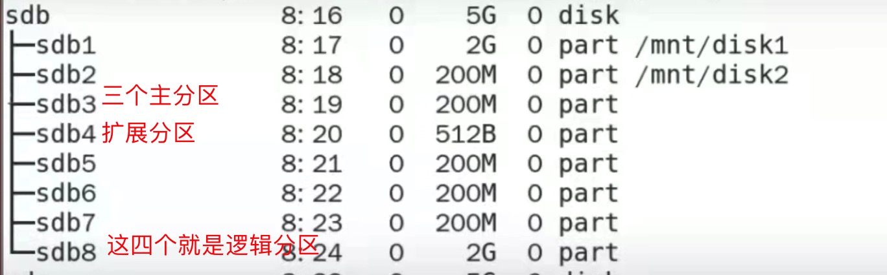

#### 概念
- 上一章介绍了，一个磁盘，只能有四个主分区
  - 之前，技术落后，磁盘的空间较小，四个分区够用了
  - 但是随着科技的进步，四个分区，已经满足不了需求了，所以就舍弃了一个主分区。
    - 然后，在把这个分区占用的空间，进行分区处理，分多少就没有限制了
    - 相当于，拿出一个房间，然后在这个房间中，在盖小房间
    - 但是，这些小房间，是依靠于大房间才得以存在的
- 并且，四个主分区创建完成后，就不能进行分区的创建操作了。
- 所以要想，创建扩展分区，最多只能创建三个主分区。
  - 并且扩展分区，只能创建一个
  - **所以，通常就是三个主分区，一个扩展分区**
- 然后扩展分区，又可以划分多个分区，被成为逻辑分区

- 意思就是：牺牲掉一个主分区，然后在牺牲的这个主分区上，在划分区域。
  - 由于，逻辑分区占用的存储空间，就是从扩展分区上划分的。
  - 所以，**扩展分区的存储空间范围，通常就是所有的剩余存储空间**
    - 如果，不占满，剩下的存储空间就是个摆设，无法存放东西
    - 因为后续的分区，分不到这些空间了
- 只有创建了扩展分区
  - **后续的分区创建，就默认是逻辑分区了**

#### 具体创建步骤
- 要先有扩展分区
  - 创建扩展分区，在选择分区类型的时候，不选择 P，而是选择 e
- 逻辑分区的创建，和主分区的创建一摸一样，可以看主分区的创建流程
  - 只不过中间没有了，分区类型选择
- 分区创建成功后，查询是否创建成功
  - 输入 `lsblk`，如果没有，执行一下 `partprobe /dev/sdb`刷新一下，然后在查
  - 效果示例
  

#### 总结
- 需要创建的分区，如果小于等于4，则默认创建主分区
- 如果需要创建的分区，大于4，则前三个默认创建主分区
  - 最后在来个扩展分区，然后在进行后续分区的创建操作
- 在查看分区的时候，创建的扩展分区也能查看到，但是所占的空间很小，只有几百B
  - 但是不能操作它，能操作的是后面的逻辑分区
  - **逻辑分区，依靠扩展分区，如果删除扩展分区，逻辑分区也会被删除**
- **逻辑分区的格式化和挂载，和主分区的操作方式一样**
  - 只要挂载完成后，就能存放数据了
  - 其实，数据是存在了扩展分区所占用的存储空间中
    - 逻辑分区，就是把扩展分区的存储空间，在划分成一块一块的。
    - 但是，扩展分区的存储空间存放数据，只能通过逻辑分区
      - 逻辑分区才能正常使用，存放数据
      - 扩展分区是无法被挂载文件夹，存放数据的
- **最后一个逻辑分区，也要占用扩展分区剩余的所有存储空间**
  - 如果有剩余的空间，则剩下的将无法使用
  - 是不能通过扩展分区，往内部存放东西的