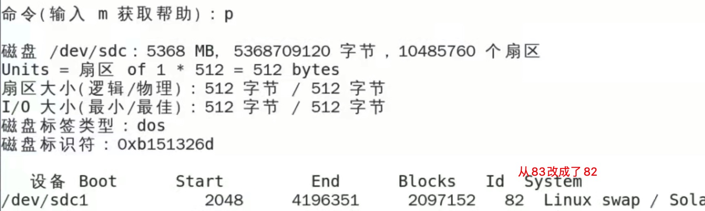
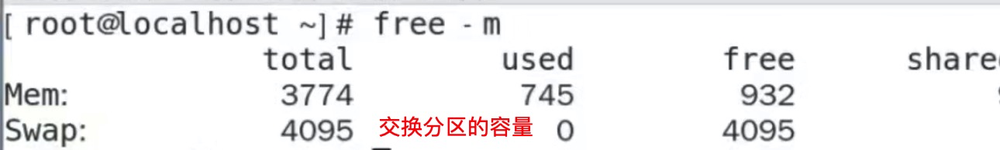

#### 概念
- **理论上扩张内存的容量，防止内存溢出**
  - 本质上并没有什么变化
- 因为内存读取速度快，磁盘读取速度慢，但是cpu操作速度快
  - 所以，通常都是 cpu 去内存读取数据，内存去磁盘读取数据
  - 由于，磁盘读取慢，所以，内存就时不时的去读数据，然后存在内存中
- 为了防止数据过多，造成内存溢出，所以就**在磁盘上，找一个分区，作为交换分区**，以此来扩大内存存放数据的容量。
  - **本质上：交换分区还是在磁盘上，所以内存容量不变**
  - 只不过，**当内存存不下的情况下，就会把数据存放到交换分区中**，这样，就看似扩张了内存的容量
    - linux中叫：swap
    - windows中：被称为虚拟内存
  - 由于交换分区还是在磁盘上，所以读取速度并没有很大的提高，只不过内存在查找数据的过程中比较快。
    - 能迅速的定位到数据，并读取出来
- 由于，交换分区是内存存不下数据，往内部存放数据的。所以我们无法手动往内部存放数据，也就是无法控制
  - 交换分区，不要过大，通常为内存的 2倍，并且一般不会超过 20G

#### 交换分区的创建方式
- 第一步，创建分区：fdisk /dev/sdb（普通的创建分区方式）
  - 输入 n 创建分区，后续步骤和创建普通分区一样
  - 创建完分区后，只要不输入 w，还可以进行后续操作（比如重新创建，因为又回到了第一步）
  - 输入 p 可以查看创建的分区信息，其中有一列 id，表示磁盘标识符
  
- 第二步，修改标识符（新版这一步可以省略）
  - 默认是83，要修改成82，注意：不能退出分区的创建对话框
  - 输入命令 t，然后选择分区。然后在输入 82，敲击回车键，就设置完成
  
  - 可以在利用 p 进行查看，是否设置成功
  
  - **分区创建完成后，该输入 w进行保存了**
- 第三步：输入 `partprobe /dev/sdc`，刷新磁盘
- 第四步，格式化，`mkswap /dev/sdc1`
  - /dev/sdc1 就是刚才创建的分区路径
- 第五步，挂载，`swapon /dev/sdc1`
  - /dev/sdc1 就是刚才创建的分区路径

#### 交换分区的查询
- 经过上面的五步，交换分区就创建好了
- 可以查询，交换分区的容量是否变大，如果变大说明创建成功
- 查询交换分区的容量
  - 输入指令：`free -m`
  
- 可以先查询一次，创建完成后在查询一次，这样两次一比较就能看出来是否变大
- 查询出来的结果，是所有 Swap 加起来的总和容量，并不是一个一个的分区列出来