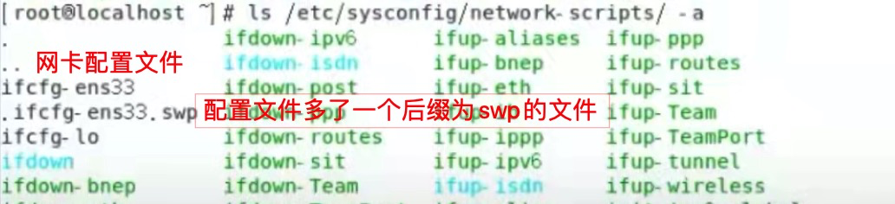
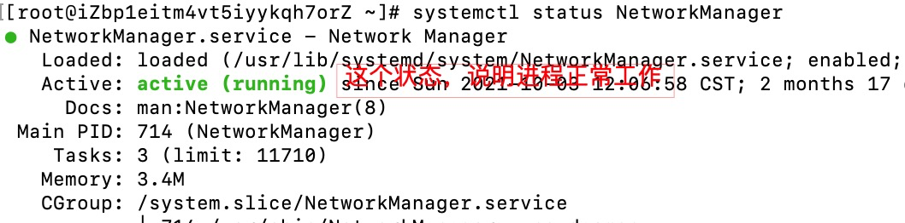
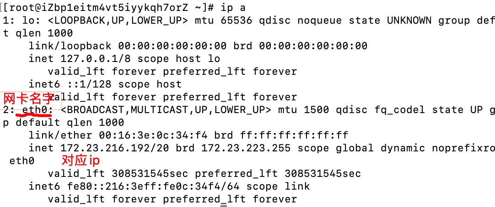
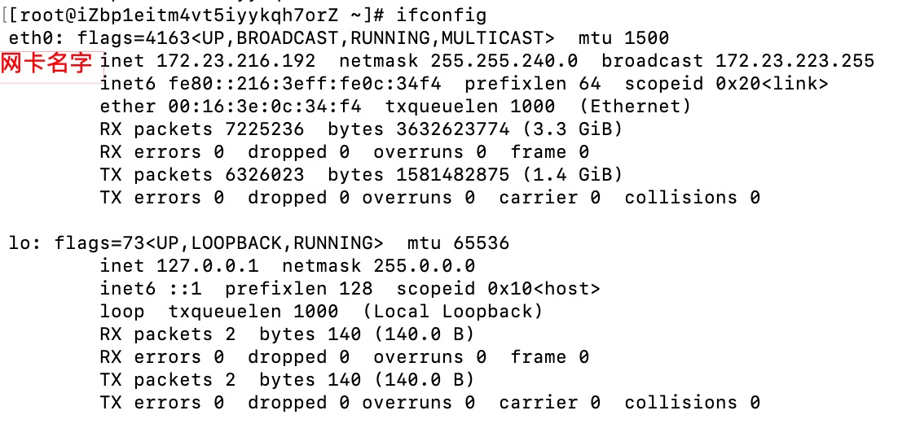

#### 查询操作
- 查询网卡名称
  - 输入指令：`nmcli device`
    - 如果没有 nmcli 这个命令，需要安装：`yum -y install NetworkManager` 
  - 查看结果
  
  - 只有 type 为 ethernet 的才是真正的网卡

- 查询网卡的配置文件所在的位置
  - 输入指令：`ls /etc/sysconfig/network-scripts/`
  - 查看结果
  

#### 配置网卡的注意事项
- 如果配置了网卡对应的配置文件，导致网卡不能工作，可以查看两个位置
  - 查看配置文件路径下，有没有.swp文件。
    - 查看方式：`ls /etc/sysconfig/network-scripts -a`
    - 如果查询效果如下：
    
    - 就需要把.swp文件删除
  - 查看NetworkManager进程是否处在工作中
    - 查看方式：`systemctl status NetworkManager`
    - 如果查询结果为
    

#### 配置网卡（操作配置文件）
- 进入对应网卡的配置文件
- ONBOOT=yes
  - 是否启用网卡，yes为启用，no为关闭
- BOOTPROTO=dhcp
  - 分配IP，是自动分配还是手动分配
    - 自动分配，开机的时候，路由器自动分给你一个没有使用的IP
  - dhcp，表示自动分配。
  - 如果手动分配：要设置成 none
- 手动配置IP
  - IPADDR=192.168.10.32，IP
  - NETMASK=255.255.255.0，子网掩码
  - GETEWAY=192.168.10.2，配置网关，也叫默认路由。这个配置对了才能上网
  - DNS=192.168.10.2，DNS解析

#### 网卡配置文件修改后，要重启(刷新)才能起作用
- 输入指令：`systemctl restart network`

#### 查看IP
- 输入指令：`ip a`
  - 会列出所有的网卡IP，所以要找到对应的名字
  - 比如：
  
- 输入指令：`ifconfig`
  - 会列出所有的网卡IP，所以要找到对应的名字
  - 比如：
 

#### 查看网关（默认路由）
- 输入指令：`ip route`

#### 查看当前网段下的所有服务器（可以ping通的服务器）
- 输入指令：`ip neigh`

#### 查询使用的端口
- 输入指令：ss -tnl