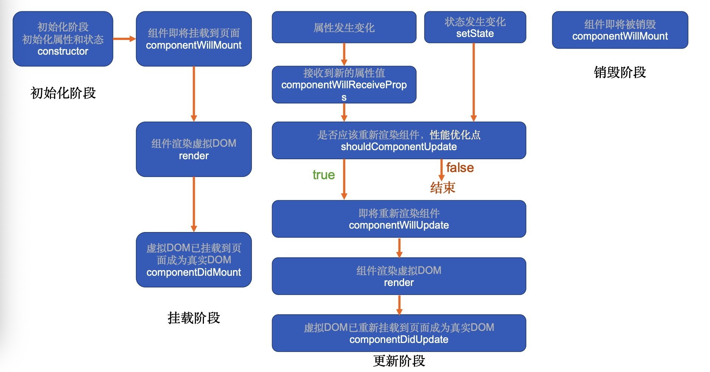
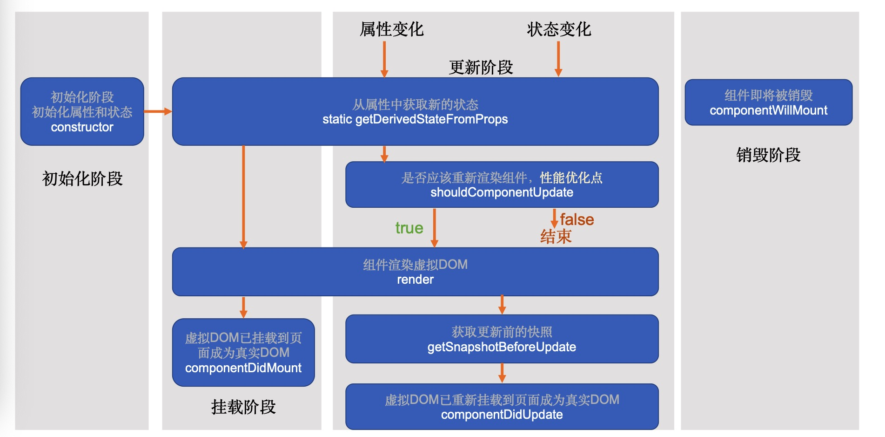

- 生命周期只存在于类组件中，函数组件不存在生命周期，但是可以借助hooks实现生命周期的一些功能

#### 旧版生命周期
- 版本：React < 16.0.0

- 图解

- 具体生命周期介绍
  - componentWillMount
    - 可以使用setState，但是为了避免bug，不建议使用
  - render
    - 返回一个虚拟DOM，会被挂载到虚拟DOM树中，最终渲染到页面的真实DOM中
    - render可能不只运行一次，只要需要重新渲染，就会重新运行，所以严禁使用setState，因为可能会导致无限递归渲染
  - componentDidMount
    - 通常情况下，会将网络请求、启动计时器等一开始需要的操作，书写到该函数中
  - componentWillReceiveProps
    - 即将接收新的属性值，参数为新的属性对象
  - shouldComponentUpdate
    - 指示React是否要重新渲染该组件，通过返回true和false来指定
    - 默认情况下，会直接返回true
  - componentWillUpdate
    - 组件即将被重新渲染
  - componentWillUnmount**
    - 通常在该函数中销毁一些组件依赖的资源，比如计时器

#### 新版生命周期

- 移除了一些周期函数，加入了一些周期函数

- 图解

- 版本：React >= 16.0.0

- 函数详解
  - getDerivedStateFromProps
    - 通过参数可以获取新的属性和状态
    - 该函数是静态的
    - 该函数的返回值会覆盖掉组件状态
  - getSnapshotBeforeUpdate
    - 真实的DOM构建完成，但还未实际渲染到页面中。
    - 在该函数中，通常用于实现一些附加的dom操作
    - 该函数的返回值，会作为componentDidUpdate的第三个参数

#### 扩展
  - render函数，创建虚拟dom，如果某个元素是一个组件，于是触发子组件的生命周期，创建虚拟dom
  - 所以componentDidMount要等子组件创建完成后，才会执行
    - 并且子组件的componentDidMount先执行
    - 因为创建真实dom，如果遇到组件，要先创建组件的，组件创建完成后，componentDidMount 就会被触发
  - 类似递归，先外后内（render前），在内到外（render后）
