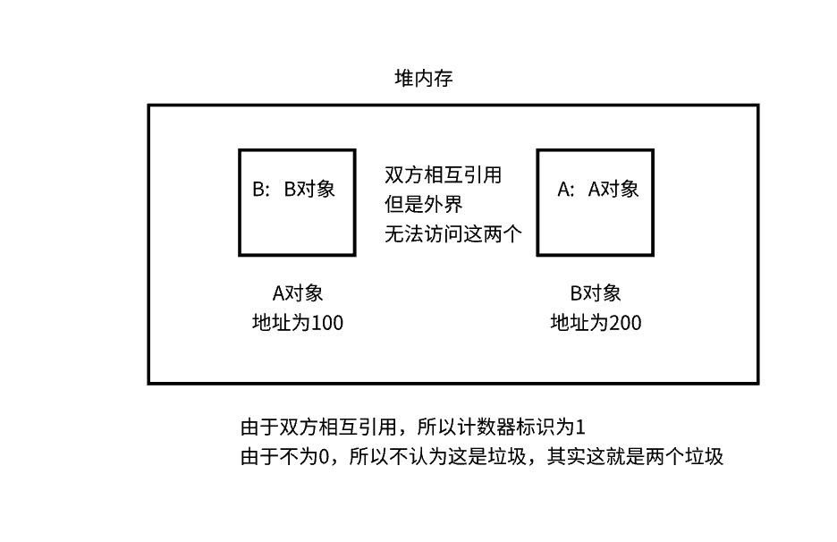

<script src='/笔记/see/index.js'></script>
[toc]

#### 概念
- java语言具有一种特性，健壮性
  - 其中有一部分就体现在其垃圾回收机制上
  - jvm会定时的对内存中产生的垃圾数据进行回收

- 英文名：GC garbage collection
- 垃圾概念：程序在运行的过程中，会在jvm（虚拟机）内存中产生很多内容（数据），当有些内容不在被使用，就称为垃圾了

- 内存溢出（占用过多）
  - 运行的程序占用的内存过多，导致内存全部被占用，后面的放不下了，就溢出了

- 内存泄漏（垃圾过多）
  - 当内存中的垃圾过多，这样可用的内存空间就会减少，这样就造成了内存泄漏


#### 会在哪里产生垃圾（堆内存和方法区中）
- jvm在运行时，将内存分成了以下几个部分
  - 堆内存
  - 方法区（又被称为：元空间）
  - 程序计数器
  - jvm栈(虚拟机栈)
  - 本地方法栈
- 其中，345是一套的（线程独享）
  - 即：每开启一个线程，都需要为这个线程，单独开启这三个内存空间
    - 也就是一个线程就对应一套单独的这三个内存空间（独自使用）
  - 当某个线程执行结束后，与之对应的这三个内存空间就会被清空，所以不会产生垃圾
- 12是线程共享的（所有的线程公用这两个内存空间）
  - 不会随着线程的结束，而进行清空，这样就有可能会产生垃圾
  - 比如某个线程，在运行过程中，往这两个内存空间中存放了一些数据，这些数据并不会随着线程的结束而被清空，这些数据就有可能变成垃圾（无人使用了，使用这些数据的线程结束了，那这些数据自然就变成了垃圾）
  - 随着时间的增长，这个线程搞点垃圾，那个线程搞点垃圾，内存中就会充满大量的垃圾，这样就造成了内存泄漏
- **所以垃圾回收机制，主要就是针对于这两个部分的内容进行垃圾处理**


#### 堆内存和方法区主要存放那些内容
- 堆内存
  - 对象、数组（也就是使用new关键字产生的内容，即只要一使用new，就会先在堆内存中申请一块空间）
- 方法区
  - 静态变量、常量、类信息
- **需要注意的是，局部变量既不存在方法区中，也不存在堆内存中，而是存在jvm栈(虚拟机栈)中**
  - 因为，方法的执行，是在jvm栈(虚拟机栈)中进行执行的
    - 每调用一个方法，就会在jvm栈(虚拟机栈)中创建一个栈帧，然后方法在栈帧中进行执行
    - 而方法中创建的局部变量，自然就存放在这个栈帧中，也就是存放在jvm栈中
    - 而每个栈帧中的空间又分为很多部分（不同的部分存放不同的内容，具体的不进行介绍）
- **垃圾回收，主要针对的是堆内存**
  - 因为：静态变量、常量、类信息，一般这些信息就创建一次，以后基本就不会变了，所以基本上不会产生大量的垃圾。
    - 只要有一个线程在运行，程序就没有执行完成，那些定义的类，就有可能被new创建对象，所以类信息，静态变量啥的就不会被当做垃圾
  - 但是堆内存就不一样了，里面的数据经常大量创建，大量废弃，所以堆内存中，容易产生大量的垃圾
    - 因为只要一new，就会在堆内存中开辟一个空间，用来存放数据。而程序的运行离不开大量的new

- 所以说垃圾是什么：没有用的对象。这种说法是正确的（但是除对象之外，还有很多）


#### 如何确定垃圾（不能把有用的数据清掉）
- 一个对象是否为垃圾，就看这个对象有没有用，而判断一个对象有没有用，常用的有两种算法（引用计算、 可达性分析）
.
.
- 引用计算
  - 原理
    - 当一个对象被引用一次，内部就会有一个计数器标识 +1
    - 当这个引用断开时，内部的计数器标识 就会 -1
    - 当对象的计数器标识 为0时，就表示这个对象是一个垃圾了
  - 什么是引用，如下图所示
    - 
    - 如果：一个对象的计数器标识为0，说明根本就没有地址索引指向他了，也就是说这个对象无法被访问，自然就变成了垃圾（无法使用了）
  - **注意：这种算法存在问题（循环引用问题）**
    - 
    - 多个对象互相引用，但是这多个对象，外界并没有对应的地址索引，也就是无法使用这多个对象
    - 但是由于，这多个对象中，又彼此引用，所以计数器标识不为0，这种算法也就不认为这多个对象是垃圾（其实是垃圾，因为根本就访问不到，虽然A能访问B，但是A都无法被访问，B自然也就是无法被访问，但是B的计数器标识却为1，因为B认为A还在引用他，所以计数器标识不会 -1）
      

.
.
- 可达性分析 
  - java使用的就是这种方式
  - 整个程序在第一波产生的对象存储的位置称为根Root
  - **垃圾检索时，会从这个根依次找到过程中的对象，没有找到的就是垃圾**
    - 类似一个树形结构，从上到下依次检索，这样即使出现环路，也不影响，因为根本就检索不到这些环路对象，于是就全部认为是垃圾
  - 缺点
    - 实现复杂，分析量大，耗时
    - 过程处理复杂
      - 单线程检索，比较简单。但是垃圾回收线程在检索垃圾时，业务线程是处于等待过程中的
      - 多线程并发。垃圾回收线程在检索的同时，业务线程也可以继续执行
        - 不足：容易漏选垃圾（问题不大）
        - 比如：垃圾检索时，检索到这个对象的时候，这个对象刚好在使用，使用完才变成垃圾
        - 但是由于检索的时候，这个对象正在使用，说明不是垃圾，于是就过去了，即使后面变成了垃圾也选不到了，于是这个对象就漏掉了
  - 常见的根变量
    - 主方法中存储对象的变量（第一波存储对象的变量，也有可能不在主方法中，所以是第一波更为准确）
    - 存储对象的静态变量


#### 如何知道垃圾对象被回收了（finalize）
- 可以调用finalize方法
  - 这是Object上的一个方法，在类中重写这个方法就可以，当对象回收的时候，jvm会自动调用这个方法
    ```java
    public class A {
        @Override
        protected void finalize() throws Throwable {
            System.out.println("我这个垃圾被回收了");
        }
    }
    ```


- 要想看到finalize执行的效果，可能需要手动触发垃圾回收
  - 调用一下 `System.gc()` 这个方法
  - 因为：所有程序都执行完了，可能垃圾回收还没有触发，这样就看不到效果了，所以需要我们手动激活一下，让垃圾回收提前执行
    ```java
    public static void main(String[] arge) {
        // 创建一个垃圾对象
        new A();
        // 在创建一个对象，让其变成垃圾对象
        A a = new A();
        a = null;  // 这样，原来a对应的对象，就变成了垃圾，找不到他了

        // 手动触发垃圾回收
        System.gc(); 
        // 手动触发垃圾回收，并不是立即就进行垃圾回收
        //    因为这是一个线程，要等时间碎片分配给他，才会进行垃圾回收
        // 所以，有可能垃圾回收的时候，看不到效果，有可能看到一个 finalize 执行
        //    回收了一个，时间碎片就重新分配到了业务线程，于是业务线程就会执行一个，然后业务线程结束
        //    这样垃圾回收，在回收另一个的时候，finalize 就看不到效果了
        // 其实，上面产生了两个垃圾对象，两个finalize都会执行的
        //    多执行几次就能看到效果，两个回收的时候程序还没有结束，就能看到两个 finalize 执行的效果
    }
    ```

- **finalize 可以实现对象的复活** 
  - 这也是这个方法的主要作用
    ```java
    public class A {
        @Override
        protected void finalize() throws Throwable {
            System.out.println("我这个垃圾被回收了");

            // 由于 finalize 在回收前执行，如果重新负值，把索引重新交给别人，这样又可以访问了
            //     finalize 执行前，这个对象还是个垃圾，执行完后就复活了
            // 这样这个垃圾就不会被回收了
            Demo.a = this;
        }
    }
    ```
    - **需要注意一点**
      - 复活后的垃圾，如果再次变成了垃圾，则在回收的时候就不会在执行 finalize 方法了
      - **也就是说：只能复活一次，只有一个机会**


- **注意点**
  - 如果重写了 finalize 方法，对象回收的时候，并不会立即回收（如果没有重写，会立刻回收）
  - 而是把要回收的对象，放在一个队列中，当时机到了，挨个执行队列中的 finalize 方法
  - 那些没有被复活的对象，说明是垃圾，要被回收了，但是却没有被回收，依旧在内存中存在（占有内存）
  - **而这些垃圾对象，会在下一次垃圾回收的时候，才会被真正回收**
.
- 注意: 这个方法不能在枚举，即 `enum` 重写，原因: enum自动继承Enum类，在Enum类中，`finalize`进行了重写，并且设置成了 `final`。所以造成了enum中无法进行重写


#### 垃圾回收的方式（三种）
- 标记清除法
  - 效率比较高，但是会产生内存碎片
  - 方式如下
    
    - 这样垃圾回收后，就会产生三个内存碎片
    - 如果这是又有一个数据需要存储，并且占用的内存一块空间装不下，于是就会把这个数据进行拆分，存到内存碎片中
    - 当使用的时候，在从内存碎片中读取出来，然后进行拼接
    - 但是，随着时间的越长，内存碎片就会越多，内存碎片越多，每次存放数据和读取数据都进行拼接，速度自然就慢下来了（于是就会造成卡顿，比如手机随着时间会越来越慢）

.
.
- 复制拷贝法
  - 把内存一分为2，一份备用
  - 方式如下
    
    - **这种方法，比较适合垃圾多的清除，如果垃圾比较少，就不适合使用这种方式**
      - 垃圾越多，重新写入的有效数据就越少，速度就会越快（写完后直接清除）
      - 比如：一千块内容，只有两块是有效的，其他都是垃圾，在拷贝写入的时候，只写入两个就行了，然后之前的那块内存空间，直接就被清除
      - 如果，一千块内容，只有两块是垃圾，那拷贝写入的时间就很长，效率低下，这种情况就不如：标记清除法或者标记压缩法了（只抹掉两块内容就行了）


.
.
- 标记压缩法（又被称为标记整理法）
  - 和标记清除法的流程一样（先标记，然后在清除）
  - 最后，会多一步，整理(又可以被称为压缩)，因为清除后会产生很多内存碎片
    - 这一步的作用，就是重新整理内存，比如：前面有内存碎片的就往前面排一排，整理完成后，剩余的空间就都在一块了，这样就避免了内存碎片的产生
  - **这种方式：比较适合垃圾少的情况**
    - 因为垃圾越少，产生的碎片越少，重排的内容就越少，速度就越快
    - 如果垃圾多，产生的内存碎片就会越多，东一个西一个，此时整理的内容就会很多（需要把这些碎片集中到一块），效率低下，此时就不如使用：复制拷贝法了
  


#### 分代算法（优化垃圾回收效率）
- 针对垃圾回收，将堆内存又进行了更细致的划分（每一部分使用不同的算法，提高效率）
- 分成了
  - **年轻代**：存放的都是一些刚产生的对象，或者经历垃圾回收次数少的对象（年轻代也被分为两块）
    - **伊甸区**：所有新产生的对象，都会放在伊甸区，我们认为这一部分的对象经常会被垃圾回收，而且回收的数量较多，所以年轻代采用的是复制拷贝法，把伊甸区有用的内容，拷贝到幸存区
      - 方法在栈中执行完成后，就会弹栈，那这个方法产生的一些对象，就有很大概率变成垃圾对象，尤其是局部对象
      - 所以，这些新创建的对象，被回收的概率较大，即产生的垃圾较多，所以放在伊甸区中，用复制拷贝法进行垃圾回收处理
    - **幸存区（两个）**：当伊甸区在此进入垃圾回收的时候，又回产生有用的数据，拷贝到幸存区，而幸存区之前可能拷贝了伊甸区的内容，而这一部分老内容，也有可能产生垃圾，所以也会进行垃圾回收处理。回收方式：幸存区不是有两块吗，一块备用，于是就把老的内容，和新的伊甸区拷贝过来的内容，重新写入另一个快幸存区中，之前的那一块擦除。当伊甸区再次拷贝过来内容时，旧的在进行垃圾回收处理，然后把有效的和新的写入之前擦掉的那块幸存区。即两块幸存区轮着用（每次占用一个，使用的也是复制拷贝法）
  - **老年代**：经历垃圾回收次数多的对象
    - 经过了多轮回收处理，对象还不是垃圾，于是这个对象就会写入老年代中（最多15次，可以使用jvm参数配置次数）
    - 伊甸区的存活对象占用空间较大，幸存区装不下了，就会直接写入老年区中
    - 由于老年区中，存放的对象都是活的比较久的对象，都经过了多轮垃圾回收，都没有被回收掉，说明变成垃圾的概率很小，也就是老年区中的对象，变成垃圾的概率较小，即老年区中产生的垃圾较少，正好使用标记压缩法
.
- 年轻代和老年代的内存比例大约是 1:2
.
- 伊甸区和幸存区(两个)的内存比例大约是 8:1:1