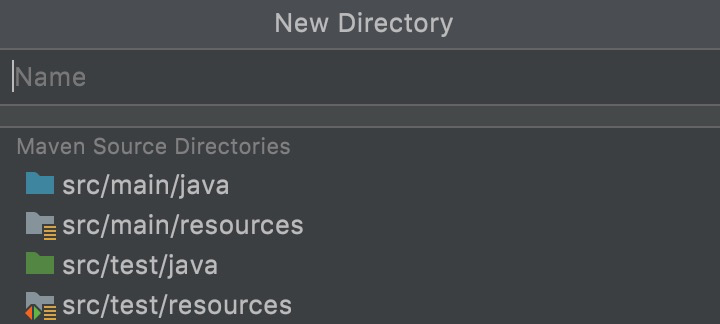

- springBoot 可以快速的搭建一个web服务，不用在依赖于tomcat
  - 用 tomcat 搭建 web服务，过于麻烦

- 搭建项目的流程
  - 第一步：点击 new Project（创建一个新的项目）
  - 第二步：选中 Maven（创建一个Maven项目，用来管理包）
  - 第三步：选中 maven-archetype-webapp （作用：创建一个web服务的项目，便于快速的创建出一个web项目）
  - 第四步：确定项目名和存储路径
    - 第一行是 name
    - 第二行是 location
    - name与路径的最后要保持一致
      - 比如 demo --> a/b/demo  (要保护一致，最终会在b下，创建出一个demo文件夹，用来存放项目代码)
  - 第五步：建立项目文件路径
    - 在根目录下创建一个 src 文件夹
    - 在 src 下创建，两个文件夹（main、test）
    - 在 main 下创建，两个文件夹（java、resources）
      - 其中，java文件夹下，存放的就是项目代码（controller、service、dao、domain）
      - 其中，resources文件夹下，存放的是配置文件（比如：application.yml 默认配置文件，可以配置一些端口啥的）
        - **resources文件夹，需要改变文件夹属性，变成一个配置文件夹**
          - 右击文件夹，找到 Mark Directory as，然后选中 Resources Root 就可以了
    **一般，在根目录下点击创建文件，编辑器会自动检查有没有src文件，如果没有，会出现创建的快捷方式**
      - 
      - 选中这四个文件夹就可以一次性创建成功

.
.
- 项目搭建完成后，配置 pom.xml 文件（引入 SpringBoot 的项目依赖包），具体的配置示范如下：
```xml
<!--超级父pom  是springboot父依赖   声明版本号-->
<parent>
    <groupId>org.springframework.boot</groupId>
    <artifactId>spring-boot-starter-parent</artifactId>
    <version>2.1.8.RELEASE</version>
</parent>

<dependencies>
    <!--web项目需要使用的-->
    <dependency>
        <groupId>org.springframework.boot</groupId>
        <artifactId>spring-boot-starter-web</artifactId>
        <exclusions>
            <exclusion>
                <groupId>org.springframework.boot</groupId>
                <artifactId>spring-boot-starter-tomcat</artifactId>
            </exclusion>
        </exclusions>
    </dependency>
    <dependency>
        <groupId>org.springframework.boot</groupId>
        <artifactId>spring-boot-starter-jetty</artifactId>
    </dependency>
</dependencies>
```


.
.
- 搭建项目的测试代码（测试工程是否好用）
  - **需要在main/java文件夹下，在建立一个根文件夹，所以的java代码都在内部写，否则启动不了**
    - 原因：SpringBoot，会自动扫描文件夹下的所有文件（如果有Spring注解的，自动创建对象，然后管理起来），如果不确定一个根文件夹，就无法进行扫包，从而报错

- SpringBoot需要自己手动写主函数，而Tomcat是已经写好了
```java
// 该注解，表示需要启动一个boot
@SpringBootApplication
public class DemoApplication {
    public static void main(String[] args) {
        // 在主函数中启动boot，传入主函数所属的类，和参数
        //    会 Demo.class 得到父级文件的路径，然后自动扫描该路径下的所有文件，解析注解，构建Spring 和 SpringMVC
        //    这样做的好处，不用写配置文件了，Spring中的设置，全部依靠注解，所以要了解注解开发
        SpringApplication.run(DemoApplication.class, args);
    }
}
```
- 后续的代码，和SpringMVC中的写法一样，比如创建一个接口
```java
@Controller
public class A {
    @RequestMapping("/hello")
    @ResponseBody
    public String hello(){
        return "Hello g";
    }
}
```