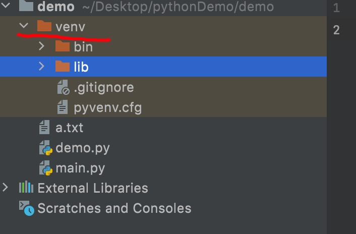

- 环境，就是当前项目运行时所处的环境
  - 安装的 python，就是安装环境
  - 可以所有项目，都位于该环境下，进行执行
  - 但是，会有插件不好管理的问题
    - 使用 pip 安装的插件，全部位于 python 下的 lib/site-packages 中，并不在项目文件中
    - 这样，管理起来就很麻烦

- 虚拟环境，只为对应的项目提供环境
  - 与对应项目有关的插件，全部在对应的项目文件中

- 虚拟环境，就是把 python 复制一份，放在项目文件下的 even 文件夹下
  - 比如
  

- 虚拟环境的设置，在创建项目的时候，可以进行指定
  - 比如
  
  - 当选择虚拟环境后，该项目所安装的依赖，就都会放在 even 下的 lib/site-packages 中
  - 这样的话，该项目使用的依赖，就可以一目了然
