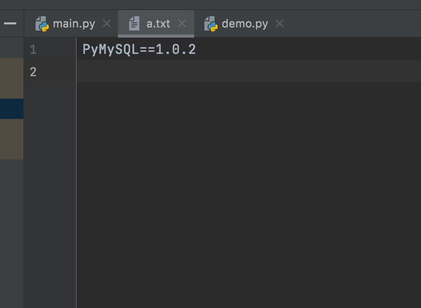

- 当一个项目需要发送给别人的时候，不光要发送代码文件，还要告诉别人依赖
- 此时我们创建的项目，就要使用虚拟环境，因为虚拟环境，依赖好找
- 即使依赖容易找到，传输项目的时候，也不可能把依赖文件也打包过去
  - 通常，都是把依赖名称和版本号，放在一个文件中，把该文件发送过去
  - pip 提供了一个命令，依赖文件可以直接生成
  - 打开命令行，输入： **pip freeze > a.txt**
    - 表示：把该项目用到的依赖，全部写入 a.txt 文件中
  - 文件样式为：
  

- **根据生成的依赖文件，导入项目使用的所有依赖库**：pip install -r a.txt