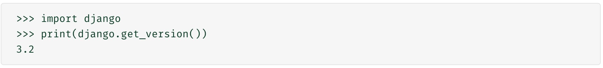

- 中文文档：https://www.runoob.com/django/django-tutorial.html

#### 安装流程
- 要先打开一个虚拟环境（要使用pip安装）
- 然后运行 **pip install django**
  - 安装指定版本：pip install django==2.2
- 验证是否安装成功
  - 在该虚拟环境中，执行下方代码，会打印出版本号
  ```py
    import django
    print(django.get_version())
  ```
  - 可以使用 py文件，然后编辑器执行
  - 也可以直接在命令行中执行，执行过程如下（出现 >>> 才可以输入 python 代码）
  


#### 虚拟环境的创建
- 手动创建一个（具体方法，看之前的说明）
- 使用 PC编辑器，创建一个项目，会自动的搭建出一个虚拟环境（even）


#### 使用 django 创建一个项目
- 在虚拟环境中，输入命令：**django-admin startproject 项目名称**
  - 要在 django 所处的虚拟环境中，执行上面的命令，才能找到 Django，从而创建项目


- 虚拟环境命令行的样式如下（ 前面有一个 （） ）
```py
(venv) liushanzhuang@192 demo2 % 
```
- **项目创建完成后，最好单独用编辑器打开该项目，然后配置环境**
  - 否则，自动引包的时候，可能会带上项目名字，这样在运行的时候会报错


#### django 项目的启动
- 在虚拟环境中，输入命令：**cd 项目名称**，进入到项目中
- 然后在输入命令：**python manage.py runserver**，启动项目
- 最终，会开启一个服务，访问：http://127.0.0.1:8000/，就可以看到一个默认页面
  - 上面的访问路径，启动项目后，会进行显示


**PC编辑器，下面有一个命令行按钮，点击后，会自动进入该项目对应的虚拟环境** 