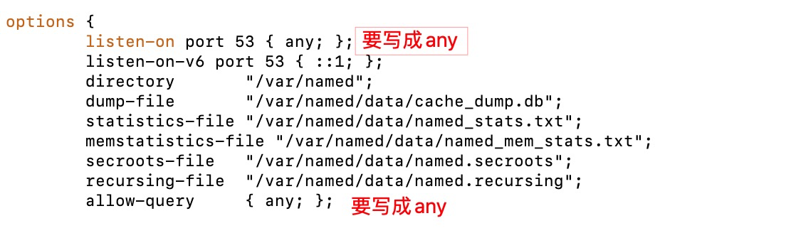
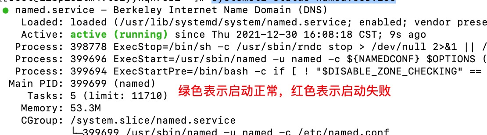
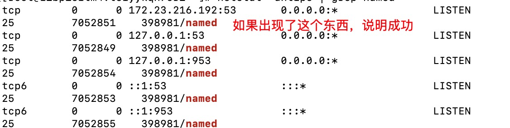
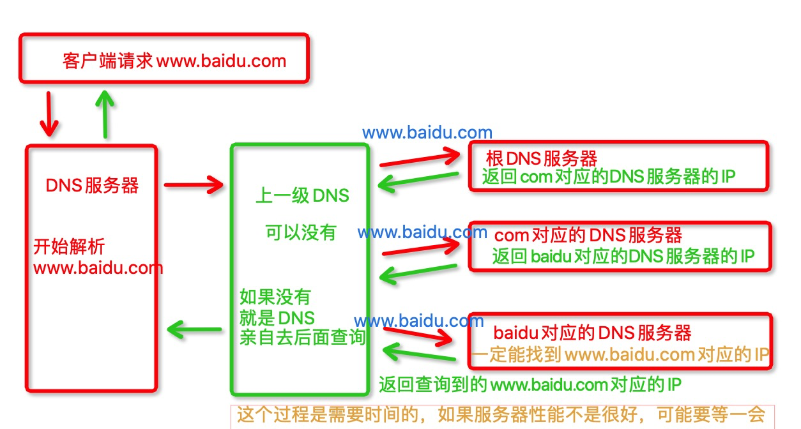

#### 注意点
- 防火墙53端口要允许通行，如果**设置协议类型为自定义TCP，端口选择53，是不行的**
  - 关闭防火墙，或者设置成全部通行
- **重启DNS服务器，一定要杀死53端口，否则启动不成功**
  - 杀死端口：`fuser -k -n tcp 53`
  - 输入指令：`netstat -antlpe | grep named`，没有输出，说明杀死成功


#### 搭建DNS的流程
- 下载 DNS 服务
  - `yum install bind.x86_64 -y`，利用yum将DNS服务下载下来
- 配置开启的ip
  - 输入指令：`vim /etc/named.conf`
  - 主要修改两个地方
  
- 将dns设置为本机ip
  - 输入指令：vim /etc/resolv.conf               
  


- 配置正向解析
  - 编辑 /etc/named.rfc1912.zones 文件（配置域）
    - 输入指令：`vim /etc/named.rfc1912.zones`
      - 里面的东西可以全部删除，只是一些示例
    - 加入如下内容
    ```js
    // lsz.net.cn 对应的域
    zone "lsz.net.cn" IN {
        type master;
        file "net.cn.zone";  // 处理的文件，要存在，名字无所谓
        allow-update { none; };
    };
    ```
  - 在/var/named/下创建对应的处理文件（net.cn.zone）
    - 切换到/var/named/目录下：`cd /var/named/`
    - 然后复制一份已有的文件，便于编辑
      - 输入指令：`cp -a named.localhost net.cn.zone`
    - 编辑文件
      - 输入指令：`vim net.cn.zone`
      - 文件内容
      ```js
        $TTL 1D
        // lsz.net.cn. 对应的域名。
        //    最后一定要加上 .
        // 2499302263.qq.com. 表示邮箱
        @	IN SOA	lsz.net.cn. 2499302263.qq.com. (
                            0	; serial
                            1D	; refresh
                            1H	; retry
                            1W	; expire
                            3H )	; minimum

            // lsz.net.cn. 对应的域名。
            //    最后一定要加上 .
            NS	lsz.net.cn.
            A	127.0.0.1
            AAAA	::1
        
        // 对应的映射
        //    访问 demo.lsz.net.cn，就会解析成 116.62.144.17
        demo   A        116.62.144.17
      ```
  

- **配置完成后，需要重启 DNS**
  - 输入指令：`systemctl restart named` 
  - 重启的时候，一定要注意，53端口要关闭，否则会报错
    - 报错信息
    ```js
    Job for named.service failed because the control process exited with error code.
    See "systemctl status named.service" and "journalctl -xe" for details.
    ```


#### 查看DNS是否开启成功
- 输入指令：`systemctl status named.service`
  - 效果如下
  
  - 如果是红色说明启动失败，可能53端口没有关闭，就进行了重启

#### 查看DNS端口是否开启成功
- 输入指令：`netstat -antlpe | grep named`
  - 效果如下
  
  - 如果只有 127.0.0.1:53，说明 /etc/named.conf 文件下，两个修改为 any 的地方，没有被修改


#### 把DNS云服务器加入到当前网络中，就能用 ping 进行测试了

**域名可以随便搞，即使没有在万维网注册也能用**


**如果是局域网，服务器的IP，要手动配置，不能采用自动获取**
  - 服务器IP要固定


#### DNS服务器工作图解
