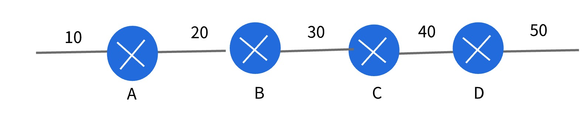

- 默认路由使用不当引起
  - 两个默认路由紧挨着，然后访问一个不存在的网段就好产生环路震荡

- 比如
  
   - B 配了一个默认路由：0.0.0.0 ---> 30.1.1.2
   - C 配了一个默认路由：0.0.0.0 ---> 30.1.1.1
   - 当访问50的时候，就会出现环路
     - 到达 C 没有五十的直连路由，也没有静态路由，于是找默认路由，数据发送到B
     - 到达 B 没有五十的直连路由，也没有静态路由，于是找默认路由，数据发送到C
     - 这样就会陷入一个环路，B和C之间来回发送，直到IP包头中的TTL衰减到0，路由器就会干掉这个包