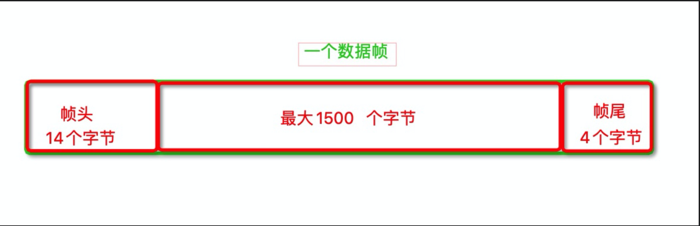

- 数据链路层，作为第二层（从外向里），包含帧头帧尾（二层头，二层尾）
- 帧尾就 4个字节 （32个比特，也就是32个 0 和 1）的数据
  - 作用是进行校验
- 帧头共有 14个字节的数据，其中包含 
  - 源mac地址（当前电脑），6个字节
    - 比如: a1-32-34-34-12-e3
    - 每一段是一个十六进制的数据，转换成二进制，正好一段是八个0或者1
    - 也就是一段就是一个字节的数据，共6个字节
  - 目标mac地址（服务器），6个字节
    - 比如: a1-32-34-34-12-e3
    - 每一段是一个十六进制的数据，转换成二进制，正好一段是八个0或者1
    - 也就是一段就是一个字节的数据，共6个字节
  - **类型**，两个字节
    - 有两种值
      - 0x0800
      - 0x0806
    - 大小计算
      - 两个数字是一个16进制的数据，一个十六进制的数据，转换成二进制，正好一段是八个0或者1，也就是1个字节
      - 所以共两个字节
    - 作用：标示网络层用的是哪一种协议，这样的话，接收方的网络层才能根据这个标识，利用对应的协议进行解析
      - 0x0800：IP协议
      - 0x0806：ARP协议
- **帧头帧尾中间的数据，也有大小限制**
  - 默认最大为：1500个字节（包含三层头(网络层)，四层头(传输层)数据和应用数据）
  - 所以，传输层会进行数据的拆分（把应用层的数据拆分成一段一段的）
    - 应用层也会根据对应的协议加上一些头部数据，如果过大（比如headers过多），就可能拆分成一个包发出去了。如果过小就会夹杂着一些原始数据，作为一个包往外发送
  - 接收方的传输层会进行重组
  - 最大值可以修改，如果改成 1400，对方发送的数据还是 1500的话，就会导致接收失败（会忽略这个帧）
    - 所以，要想修改，两方都要修改

