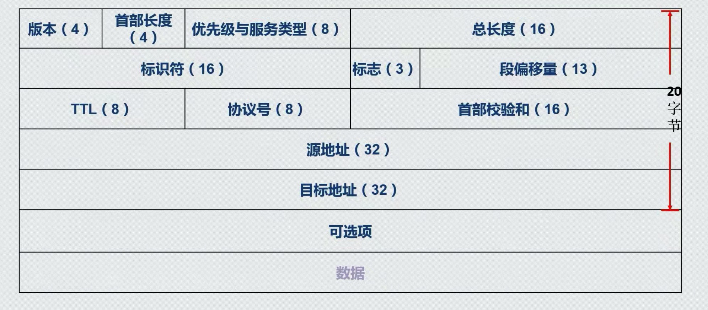
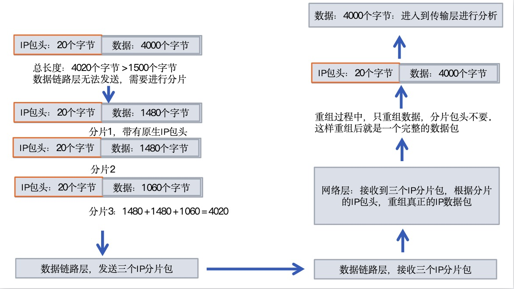

#### IP包的结构示意图

- 上面的单位是比特（8个比特为一个字节）
- 第二行和IP分片有关
- IP包头的长度不固定，长度区间为：20 - 60 个字节

#### IP包头每个部分的作用
- 版本
  - 说明是IPv4 还是 IPv6。
  - 现在一般是IPv4

- 首部长度
  - 标示IP包头的长度
  - 因为IP包头中有一个可选项（大小为0-40个字节，但是一般不启用），所以会造成了IP包头的长度不可控，接收方不知道IP包头的长度，就无法分析IP包头
    - 所以需要一个长度标识，标明IP包头的长度
    - 这样，接收方就可以根据这个值，截取对应长度的数据，截取下来的数据就是IP包头
    - 此时，就可以进行IP包头的分析了
  - 值一般都是 0101 
    - 表示：5 * 4 = 20 个字节

- 优先级与服务类型
  - 一位保留，只能用7个比特
  - 前三个表示优先级，后面四个表示服务类型，一个保留
  - 优先级高的先发送
    - 每个路由器可能要发送很多包，这些包就需要排队一个一个的进行发送
    - 如果优先级设的高一点，就可以插队优先发送
    - 这个需要花钱，让运营商进行设置

- TTL
  - **表示生存时间**
    - 防止网络中，垃圾包过多。如果没有TTL，可能有些包一直在路由器中来回穿梭，随着时间的推移这种包越来越多，造成网络负担
    - 所以，就搞了个生存时间，时间一到就不再发送，直接干掉。
  - 特点：每经过一台路由器，TTL的值都会减一，表示生命值衰减一
    - 当某个路由器减完一后，如果TTL变成了0，则该路由器将不再转发这个数据包（生命已经耗尽，直接被干掉）
    - 比如访问：www.baidu.com。但是TTL的值非常小，还没到达百度的服务器，TTL就变成了0，则该请求就无法到达百度服务器了
  - 环路网络
    - 比如：网络做成了环路，则数据包一直在这个网络中震荡，当到达次数，就被干掉了
    - 死循环一定会到达次数，因为每走一步TTL都会减一，最后一定会减成0，请求被干掉
    - 这样就会造成无法上网
  - 可以大概判断发送方是什么主机
    - 如果TTL小于100，则服务器一般搭建在Linux上
    - ping 可以查看 TTL，但是查看的是到达客户端的 TTL，也就是递减后的TTL
  

- 协议号
  - 识别上层协议
  - 比如TCP，使服务器根据这个标识，让上一层使用对应的协议解析该层包头
    - 6表示TCP
    - 17表示UDP
    - 1表示ICMP

- 首部校验和
  - 校验IP包头，防止被串改

#### IP分片的概念
- 由于数据帧中间的数据，只能发送 1500 个字节
- 如果一个数据包过大，则就需要对该数据包进行分割，这种方式被称为IP分片
  - 对一个完整的数据包进行分割，即包含IP包头，这样重组后就是一个完整的数据包，有IP包头进行分析
  - 每片数据，最后还会加上一个IP包头，进行发送
    - 因为最终发送的是IP分片，如果分片上没有IP包头，直接包上帧头帧尾。则到达路由器后就会被舍弃掉
    - 只有第一片数据，能正常发送，因为有IP包头（分片分的是完整的数据包）
  - 到达目标服务器后，网络层就会重组数据包，此时，分片的IP包头就会被舍弃掉
    - 然后对重组的数据包进行分析，解析IP包头
- 由于帧只能携带 1500 个字节，而分片后，每片数据又都具有一个IP包头（长度一般是 20 个字节）
  - 这样，每片数据的长度，一般都是 1480 个字节
  - 因为：1480 + 20 = 1500 个字节

#### 分片传输流程示意图

#### 涉及IP分片的IP包头中的属性
- 总长度
  - 标明这个IP包的总长度（分片前的长度）

- 段偏移量
  - 值一般是，0 或者 1480 的倍数
  - 判断分片的位置，进行重组
    - 可以看出该IP分片是IP包的第几个IP分片
  - 比如
    - 0，第一个分片
    - 1048，第二个分片
    - 2096，第三个分片

- 标志
  - 第一个比特保留，现在永远为0
  - 第二个比特，说明是否分片
    - 第二位为0，表示采取了分片，1表示没有进行分片
  - 第三个比特，说明这个IP分片，是否是最后一个分片
    - 如果是1，表示后面还有分片数据。
    - 如果为0，表示后面没有分片数据，也就是这是最后一段数据

- 标识符
  - 标明，这个IP分片属于那个IP包，防止重组的时候，产生混乱
    - 比如：同时接收两个数据包，都进行分片，如果没有标识，就可能产生第二个包的第二片数据拼在了第一个包的第二片上，造成数据混乱
  - 一般标识符都是随机产生的

