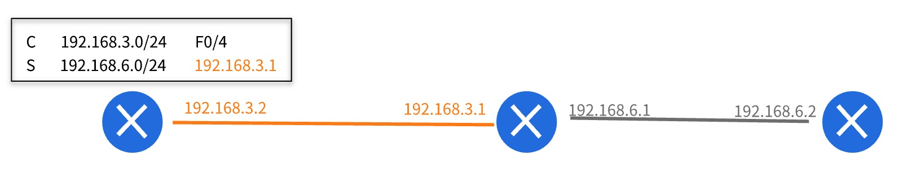
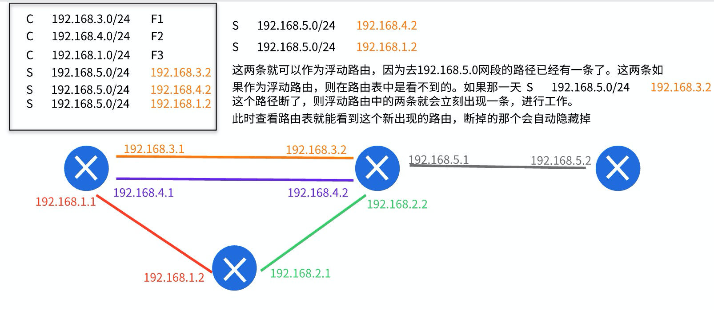

- 交换机的作用是，连接某个网段下的不同设备（局域网）
- 路由的作用，连接不同的网段，进行IP寻址

- 路由发送的过程
  - 路由工作在网络层
  - 数据到达路由后，先去掉帧头帧尾，然后取出IP包头。找到目标ip
  - 根据目标IP，去路由表中查找，这条数据往那个地方发（下一个到达的路由器），下一个路由器在进行上面的步骤

- 路由表的作用（路由表需要通过命令进行配置）
  - 直连路由  C  192.168.3.0/24 F0/4
  - 静态路由  S  192.168.6.0/24 192.168.3.1
  - 默认路由  S* 0.0.0.0/24     192.168.3.1
  - 浮动路由  
    - 可是静态路由，或者默认路由，只不过优先级不一样

- **下一跳IP**
  - 比如：192.168.6.0/24 192.168.3.1
    - 192.168.3.1 这个东西被称为下一跳地址
    - 192.168.6.0/24 这个网段不和这个路由器直连，所以就需要指定数据包下一个到达的端口
  - 当路由器接收到一个数据包后，解析IP包头，发现目标IP是 192.168.6.0网段
    - 于是就查看路由表，发现这个IP无法直接到达，但是知道这个网段的包，要发送到 192.168.3.1 这个端口
    - 而路由表中有 192.168.3.0 这个网段的出口记录 F0/4
    - 于是，数据就会到达这个端口，开始进行重新包装数据包，进行发送
   - 重新封装数据包的流程
     - 目标IP和原始IP不变，但是TTL会减一（TTL的作用，IP包头中有介绍）
     - 数据链路层的目标mac地址，会换成下一跳（192.168.3.1）的mac地址
       - 查看ARP缓存，或者向 192.168.3.1 发送ARP报文
       - 得到 192.168.3.1 的mac地址后，就会进行数据链路层的包装
   - 数据包装完成后，就会通过 F0/4 发送出去，到达下一个 路由器
   

- 浮动路由的介绍
  - 在路由表中，目标IP一样，就产生了浮动路由
    - 目标地址一样，但是有多条路径可以到达
  - 虽然有多条路径，但是只有一条工作，其他的自动隐藏，查路由表也查不出来，起备份作用
  - 但是，如果工作的路径断掉了，备用的就会立刻启用
  - 比如
  
  
