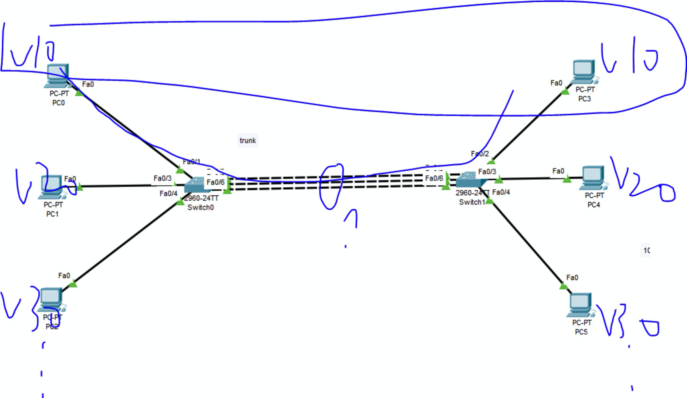
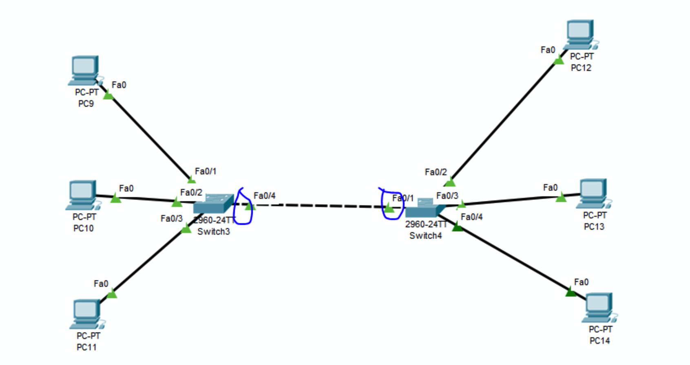

#### 作用
- 如果Vlan跨交换机传输，或者多个Vlan要经过路由器转发。如果没有Trunk的支持，将要变得很麻烦
  - 采用了Vlan，如果某个端口没有定义Vlan（不属于任何一组），是不允许传输Vlan数据的
  - 也就是Vlan跨交换机传输，或者多个Vlan要经过路由器转发，没有Trunk的支持。就需要有几个Vlan分组，就要扯几根线
  - 如下图（扯了三根线）
  
  - 那个Vlan通信，就把那条线的两端接口，加入到该组，就可以传递该组的数据
- 但是交换机与交换机一般就用一根线连着（如果采用上面的方法，浪费接口资源），如下图
  
  - **一条线允许所有的Vlan传递，就需要把两侧的端口设置成Trunk**
- Trunk可以让所有的vlan都走一条线

#### 概念
- Trunk其实是一种协议
  - 可以让所有的vlan都从Trunk端口通过
  - 一端发送，另一端接收，由于所有的Vlan都可以通过，接收端为了区分通过的Vlan属于哪一组。发送端会给发送的数据打上一个标记（VlanID）
  - 由于交换机解析的是帧头，所以VlanID，放在帧头上，发送出去
    - 根据帧头中的源mac地址，利用mac地址表，就能知道这个包从那个端口发出的，就可以利用端口得知这个包属于那个Vlan
  - 接收方就能通过帧头，得知这个数据包属于哪一组，就能根据这个标示决定广播那一组
    - 接收完，就会把VlanID拿掉，变成正常的数据包，往外发送
    - 这种行为，被称为Trunk协议
    