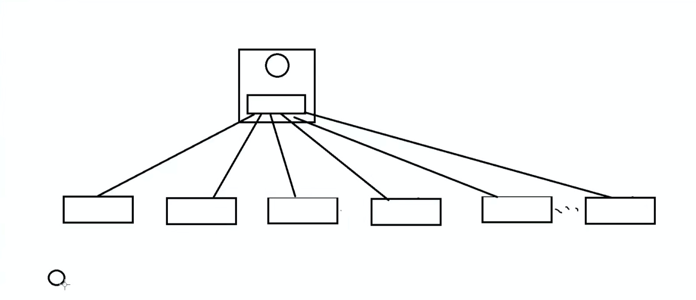

#### 概念与作用
- 三层交换机是单臂路由的升级款（和单臂路由的功能以及原理一样）
  - 把路由器集成到交换机中，完成不同Vlan间的通信
  - 由于路由器是隐藏的，所以在外观上，和不采用Vlan的网络设备结构是一样的

- 三层交换机由于涉及到了路由器，就是能解析三层（网络层）的数据，外观又是一个交换机，所以被称为三层交换机
- 三层交换机中的路由器，默认是不启用的，需要用命令开启
- 由于路由器是集成到内部，所以路由器和交换机相连的线，也是逻辑线，通过命令设置开启
  - 这样就可以不同的Vlan组，使用专门的线，不用在使用Trunk了，这样就可以减小通信压力
  - 单臂路由使用的都是实际接口，如果采用专门的线，就要使用大量接口。不仅会造成接口紧张，而且路由器的接口比较少，所以采用Trunk

#### 三层交换机的优点（较单臂路由）
- 单臂路由的缺点，以及三层交换机的优点
  - 网络瓶颈（三层交换机：每个Vlan都有单独的线路）
  - 容易发生单点通信故障（三层交换机：每个Vlan都有单独的线路，并且端口都是虚拟的不容易发生故障）
  - Vlan间的通信都要进行单独路由（三层交换机有缓存，这种现象被称为：一次路由多次转发）
    - 三层交换在完成对收到的第一个新数据流进行路由后，产生一个MAC地址与IP地址的映射表，当具有相同地址信息的数据流再次通过时，直接看这个缓存表，就直接包装好发出去了
    - 比如：V20 20.3.4.5 帧头
    - 下次在有往 20.3.4.5 发的数据包，直接就把帧头包上，从V20端口扔出去了（来一个，包装一个，流水线式）

#### 三层交换机与外界通信（上网）
- 上网就需要路由，三层交换机上内置一个路由，把这个路由与另一个真正的路由连一块，然后配置路由就可以实现与外界通信
- **配置默认路由**
  - 内置路由连接的Vlan都是直连路由，只需要配置一个默认路由，跳转到连接的真正路由，数据包就出去了（路由寻址进行通信）
    - Vlan由于都是直连路由，优先级最高，所以不会触发默认路由（不会转发到真正路由）
- **需要把与真正路由连接的那个端口升级为路由端口**
  - 路由的端口需要配置IP，但是三层交换机的接口默认是二层端口，无法配置IP。需要使用命令，把二层端口配置成三层端口才可以
  - 正是由于三层交换机的所有端口都可以升级成三成端口，所以价格较贵

  

#### 三层交换机的实际使用
- 由于三层交换机价格昂贵，如果pc较多，通常作为核心层，只负责Vlan通信（有点类似路由的功能）
- 具体的pc与普通的二层交换机连接，并且一个或多个交换机为一个Vlan组。每个Vlan组的交换机不允许互联，只能通过核心交换机连接
- 比如
  
- 如果分组过多，一个核心层的端口不够用（一个Vlan，一个端口），可以分成几个大组，每个大组在进行分组（通信比较频繁的为一个大组）
  - 每个大组配置一个三层交换机（进行路由，被称为汇聚层），然后配置默认路由，指向上一层三层交换机（核心层）
  - 汇聚层转发不了，说明这个Vlan是其他大组的，就需要上一层三层交换机进行路由
  - 由于三层交换机到三层交换机属于路由，所以连接的端口要升级为三层端口
    - 核心层为什么不直接使用路由，大组可能有很多，路由没有这么多端口，如果配置Trunk，通信压力大，有网络瓶颈问题
  

