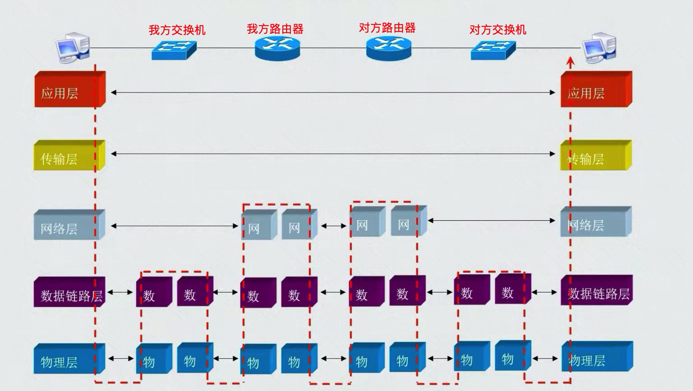

- 五层网络模型，对数据处理的简单流程图

- 其中数据链路层，后面添加的帧尾，其实就四个字符
  - 是前面的一串数据（帧头/IP包头/TCP包头/App包头/应用数据），经过加密算法计算后得出来的

- 我们的电脑，每天都可能接收一堆垃圾数据
  - 网卡接收到数据后，经过一层一层的分析
  - 比如：数据到达网络层后
    - 网络层把IP包头解析出来
    - 经过分析，发现IP地址不是当前电脑的IP地址
    - 于是，就作为垃圾信息舍弃掉了
  - 比如：数据到达传输层后
    - 传输层把TCP包头解析出来
    - 经过分析，发现本机没有开启该端口，或者防火墙不允许该端口通行
    - 于是，也作为垃圾信息舍弃掉了

#### 远程通信的简单示意图（数据流向）
- 