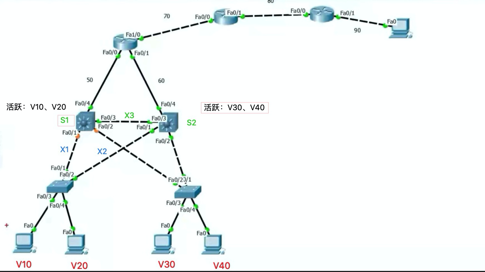
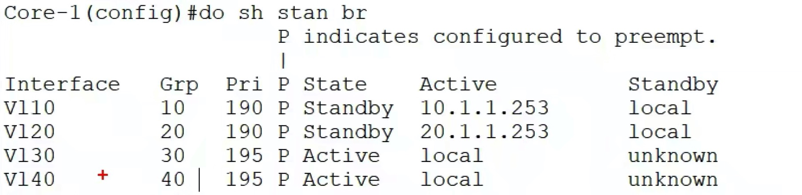
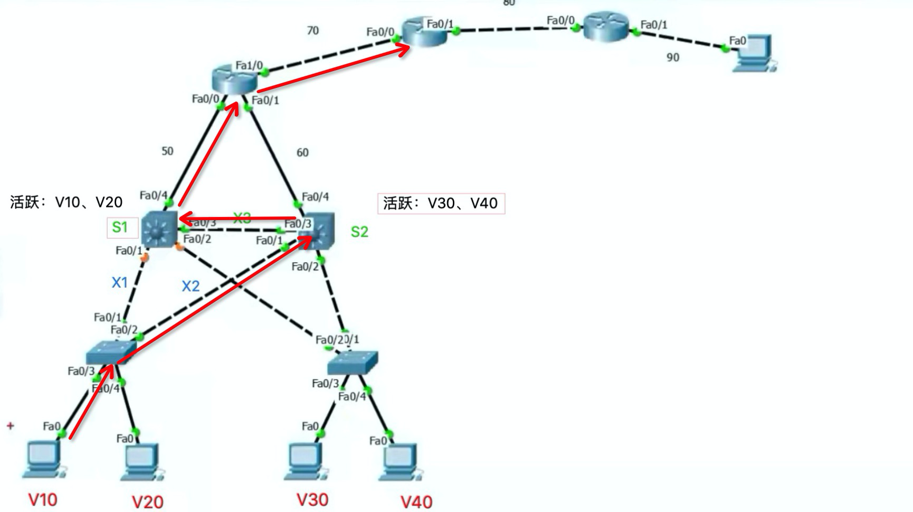

#### 示意图
  


#### 简单的工作分析
- 有四个Vlan，每个Vlan一个活跃路由，一个备份路由，本质上有八个路由
  - 由于使用的是三层交换机，所以表现为有两个核心层交换机
  - 每个三层交换机上四个路由
- 这八个路由器每个一段时间发送Hello包，在交换机的作用下，其他路由器（三层交换机中的内置路由）会接收到
  - 以此来确定四个活跃路由器，四个备份路由器
- **为了分流，通常两个三层交换机都用上（对半分），每个三层交换机两个活跃，两个备份**


#### 配置命令
```conf
int Vlan30
stan 30 ip 30.1.1.254
stan 30 prior 195
stan 30 preempt
exit
```

#### 查看



#### 两个三层交换机相连的原因
  - 为了防止某条线断掉，从而影响活跃路由器的切换（hello包收不到了，备份路由器就会变成活跃路由器）
  - 可以不相连
    - 假设没有连
    - 如果X1断掉，S1的hello包可以通过交换机2，发到S2，活跃不变
    - 如果X1、X2断掉，S1的hello包无法到达S2，活跃改变，但是此时路由还是好的，没有必要切换
    - 所以两条三层交换机之间连了一条线，这样即使X1、X2都断掉，S1的hello包依旧可以到达S2
- 由于两个交换机一连，就形成了交换机环形回路，会造成广播风暴，于是会自动down掉一个接口（逻辑down，通过计算，得出关掉哪一个，开始也是自动开启的，无法手动开启）
  - S1两个黄色的端口，就是逻辑down掉的
  - 也就是，虽然V10的活跃接口在S1上，由于直通的逻辑端口down掉了，无法通信，所以通信会先发到S2上的交换机，然后S2在传到S1，由S1进行路由传输
    - 二层传输，没有用到路由器
  - S30、S40，可以直接发到S2，由它进行路由处理，因为：端口相连，活跃路由器又在S2上，所以获取的网关mac地址就是S2
    - 如果某条线断掉了，则也会通过S1上的交换机，然后在传到S2，进行路由（如果某条线断掉，环路没有了，则逻辑down的端口会自动打开，允许通行）

- 由于路由的端口都是虚拟的，所以不会损坏，除非交换机坏掉了。
  - 一般损坏的是二层端口，与路由无关，所以没有必要进行路由的切换
  - 所以才在中间连一根线

- 上图由于X1逻辑down了，所以V10通信要拐一下，如下图
  - 


#### Vlan间通信
- HSRP针对的是往外发数据，并不针对路由数据
  - 即，V10和V30通信，虽然V10的活跃路由在S1，V20的活跃路由在S2上
  - 但是V10和V30通信，并不会涉及到S2
- V10发送数据，数据会推到S1，S1一看V30有直连路由，虽然这个路由是备份路由，但是无所谓，会直接输出
  - 不会一看是备份路由就不进行输出，而去找对应的活跃路由
  - 除非没有直连路由，才会往外路由，会发到上一个路由器，根据该路由器上的回指路由进行转发


#### 回指路由的配置
- 要配置四个正在使用的路由和四个备份路由
- 通常也是采用分流的方式
  - S1上的活跃路由是V10、V20
    - 回指路由就可以配置V10、V20，指向S2。
    - 备份路由V30、V40指向S2
  - S2上的活跃路由是V30、V40
    - 回指路由就可以配置V30、V40，指向S1。
    - 备份路由V10、V20指向S1 
- 从一端发，一端接收