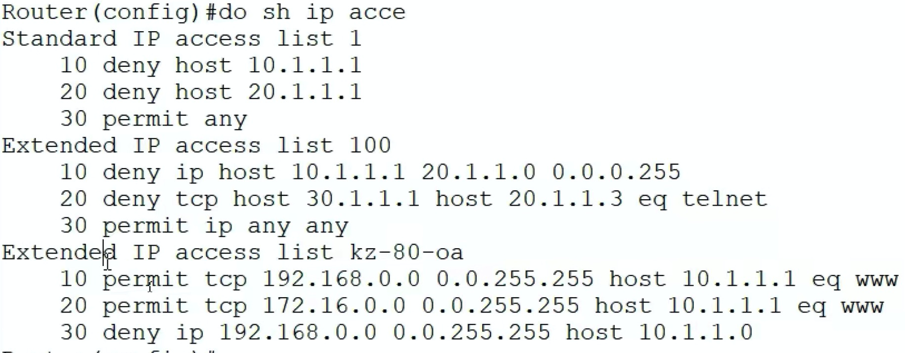

#### 标准ACL
- 只能根据源IP对包进行过滤
- 表号：1-99
- 命令
```conf
conf t
access-list 表号 permit/deny 源IP/源网段 反子网掩码
access-list 表号 permit/deny 源IP/源网段 反子网掩码
# 比如 access-list 2 permit 192.198.3.5 0.0.255.255
```
- 反子网掩码，将子网掩码的0和1倒置
  - 这个子网掩码和真实的子网掩码没有关系，只为源IP/源网段进行服务
  - 比如：255.255.0.0 的反子网掩码 0.0.255.255
  - 如果反子网掩码前面是两个0，则比较源IP和配置的源IP/源网段，前两位是否一样，如果一样就执行配置的操作（permit/deny）
    - 如果前面是一个0，就比较第一位是否一样
    - 如果反子网掩码全是0，则比较四位，也就是只针对某个固定的IP，其他的针对某个网段
    - 所以这个地方可以写 源IP或者源网段
      - 如果写源IP比较的也是前几位（网段），后面忽略。这样还不如直接使用网段，通俗易懂
      - 例如：access-list 2 permit 192.198.3.5 0.0.255.255 和 access-list 2 permit 192.198.0.0 0.0.255.255 的效果一样，但是就不如后面容易懂，一眼就知道是针对网段的
  - 反子网掩码的作用：总结上面的概述，反子网掩码和配置的源IP/源网段，比较每一位，如果该位的反子网掩码为0，则进行比较，如果为1，则进行忽略
    - 反子网掩码和源IP/源网段，都是4 * 8 位二进制数字
- permit：满足条件放行
- deny：满足条件拦截
- 如果只针对某个IP，则可以进行简写，不用再写反子网掩码（0.0.0.0）
  - 简写：access-list 2 permit host 192.198.3.5
  - 作用：如果源IP是192.198.3.5，则进行放行

- 针对所有IP
  - 比如：access-list 2 permit 0.0.0.0 255.255.255.255
    - 简写：access-list 2 permit any
  - 放行所有的IP


#### 扩展ACL
- 可以根据源IP、目标IP，协议、端口号对包进行过滤
- 表号：100-199
- 命令
```conf
conf t
acc 表号 permit/deny 协议 源IP/源网段 反子网掩码 目标IP/目标网段 反子网掩码 【eq 端口号】
acc 表号 permit/deny 协议 源IP/源网段 反子网掩码 目标IP/目标网段 反子网掩码 【eq 端口号】
# 端口号可写可不写，如果写端口号，则协议只能是TCP或者UDP
# 比如 acc 100 permit tcp host 192.198.3.5 host 192.198.4.5 eq 80
# 比如 acc 100 deny ip host 192.198.3.5 192.198.4.5 0.0.0.0.0
# 比如 acc 100 deny ip 192.198.0.0 0.0.255.255 host 192.198.4.5
# 比如 acc 100 deny ip any any
```
- 详细的介绍，看标准ACL


#### 命名ACL（不使用默认的表号）
- **最常用，编写指令编号方便，并且名字可以可视化**
- 命令
```conf
ip access-list extended 表名   # 这条命令写完，会直接进入该表的输入环境
permit/deny 协议 源IP/源网段 反子网掩码 目标IP/目标网段 反子网掩码 【eq 端口号】 
permit/deny 协议 源IP/源网段 反子网掩码 目标IP/目标网段 反子网掩码 【eq 端口号】 
# 进入环境后，不用在写 acc 表号，会自动把这条指令写入对应的表中
```


#### 把某张表应用到某个端口上（出或者入方向），拦截数据包
```conf
int f0/2  # 应用的端口
ip access-group 表号/表名 in/out  # in入，out出
exit
```


#### 查看ACL表
- 查看所有：show ip access-list
- 查看某一个：show ip access-list 表号 或者 show ip access-list 表名
