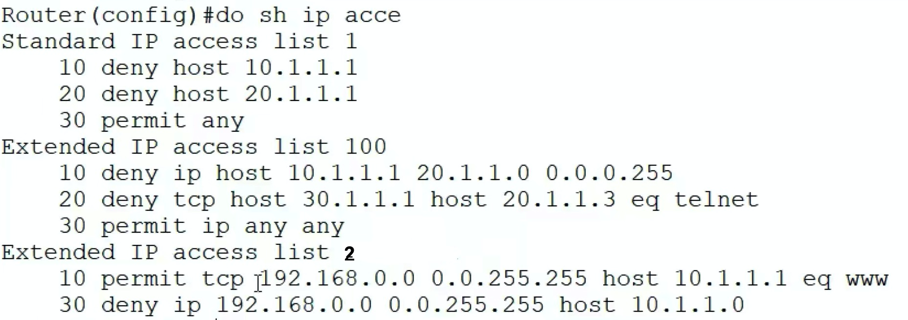
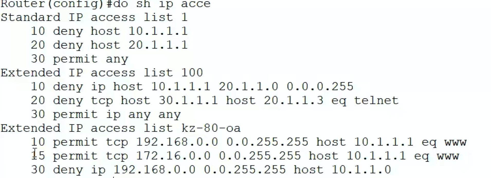

#### 删除某条指令
```conf
ip access-list extended 表名/表号
# 比如 ip access-list extended 2
no 20
# 删除 2 表中的 20号指令
exit
```
- 
- 上图表2，删除了20号指令，只剩下了10和20


#### 插入指令
```conf
ip access-list extended 表名/表号
# 比如 ip access-list extended kz-80-oa
15 permit/deny 协议 源IP/源网段 反子网掩码 目标IP/目标网段 反子网掩码 【eq 端口号】
# 这条指令就会在，比15大，比15小的两条指令的，中间插入
exit
```
- 
- 上图，15插在了 10 和 30 中间

- 默认每条指令，是10的间距（从上图就可以看出），就是为了方便插入
- 通常最后一条指令，都是默认any，所以最后一条通常设置的很大，就是为了在前面多留点插入的位置
  - 一般使用自定义ACL，编写指令编号方便
```conf
ip access-list extended zdy
10000 deny ip any any
exit
```