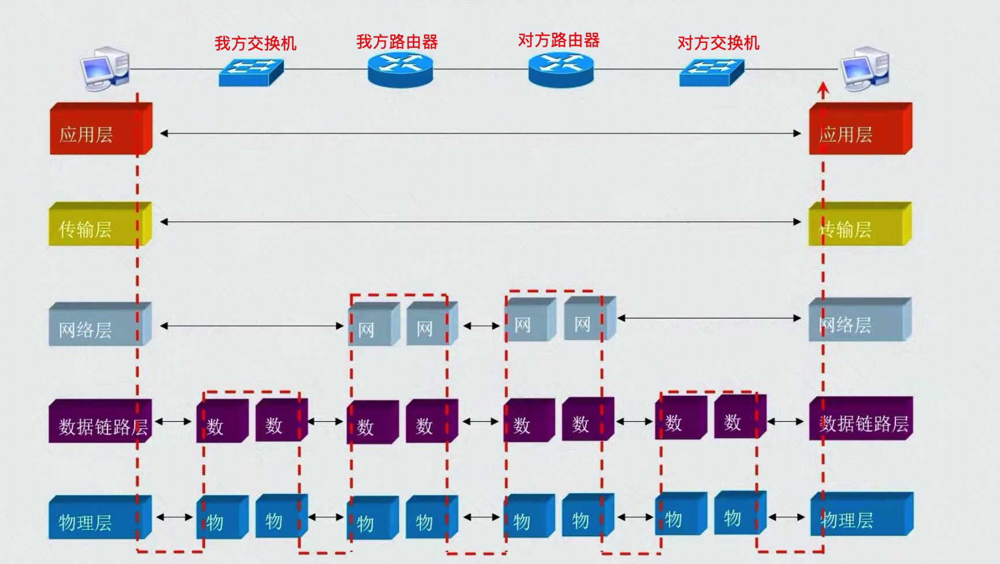
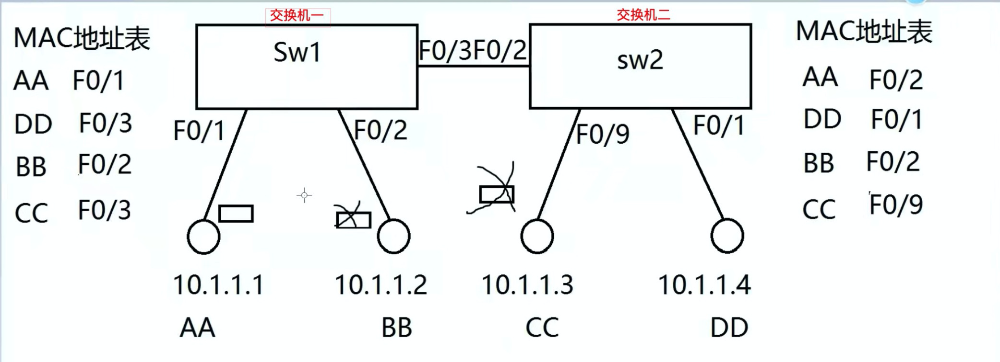

- 交换机工作在数据链路层

- 根据上一张，对帧数据结构的分析，意味着交换机只能获取到 `mac地址` 等有效信息
  - 也就是，获取不到 IP

#### 通信原理以及流程概述
- 交换机上有一个 `mac地址表`，由于交换机只能解析数据帧，得到服务器的mac地址。
- 得到 mac地址 后，先去 mac地址表 中查询，有没有对应的映射
  - 如果有，直接把数据发往对应的接口连接的计算机
  - 如果没有，交换机就不知道目标电脑连接在那个接口，不知道往哪发，**于是就采用广播的形式，都发送一遍**

- 当交换机得到一个数据帧后，交换机知道这个帧是从那个接口，发过来的
  - **解析完帧包头(二层包头)后，就可以得到该接口对应的mac地址**，二层包头中有源mac地址
  - 于是，交换机的 mac地址表中，就会记录下来。
  - 当下一次，有pc往这个mac发送数据的时候，就可以根据 mac地址表 直接找到这个接口，就不用采用轮播的形式发送了
  - **这个过程可以看作交换机的 学习过程**

- 由于pc端，只要一联网，就会发送DHCP请求，走到交换机，交换机就会保存该接口对应的 mac地址
  - 所以，交换机的 mac地址表 会瞬间构建完成

- mac地址表 中的每条记录，都有一个老化时间。
  - 时间一到，mac地址表就会删除该条记录
  - 当删除记录的pc端，重新发送包，交换机一查 mac地址表，该地址已经没有了，就会重新学习生成

- 当 交换机接口 连接的电脑发生了变化
  - 当电脑发送数据包，交换机一查 mac地址表，发现 接口与mac地址 不对应，就会重新生成新的记录，之前的记录删除

#### 简单的图形讲解

- 如果公司过多，一台交换机可能不够，需要多台配合使用

- 比如上图中的，DD往AA发送数据
  - 刚开始，进行轮播，所有的接口发送一遍
  - 当 F/2 发送的时候，另一台交换机的 F0/3接收到数据
    - 此时，交换机的一个接口接到了数据帧，于是开始学习
    - DD ---> F0/3
  - 交换机一，继续轮播，所有的接口发送一遍
  - AA 接受到数据包，于是给回包
    - 交换机一一看，这个包是发往 DD 的，于是根据 Mac地址表，直接从 F0/3 发出去了
    - 到达了 交换机二
      - 交换机二也开始学习
      - AA ---> F0/2
    - 后续步骤就一样了

- **如果，交换机的接口连接的是另一个交换机，则接口映射会有多个**
  - 交换机与交换机之间的工作是独立的，mac地址表也是独立的
- 交换机的出口不管是啥，只要有映射，就往外发
- 交换机的入口不管是啥，只要接收到数据帧，就开始分析
  - 所以，一条数据，无论经过多少台交换机，都是正常分析
  - 多几台交换机，就多几步交换机的解析流程，其他的没变

