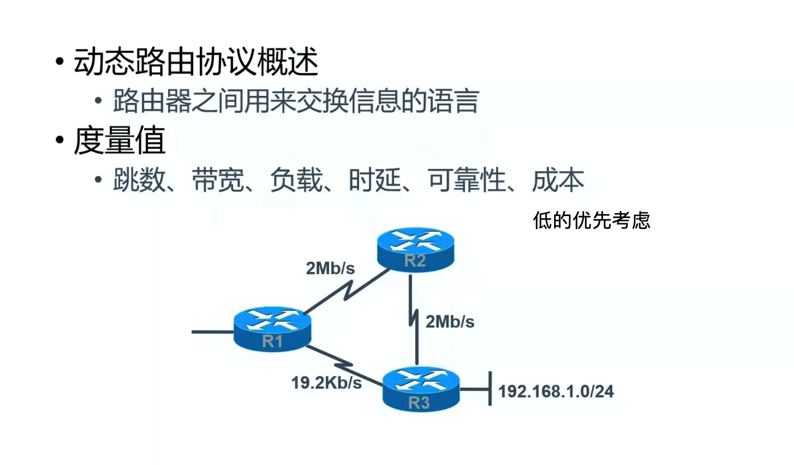

- 动态路由的介绍和优缺点 
  - 路由器的功能就是根据路由表进行路由
  - 如果网络很复杂，手工配置路由表有点麻烦，就可以使用动态路由表，动态创建
  - **并不是所有的路由链路都需要使用动态路由**
    - 动态路由的创建需要占用路由器发送数据包的资源
    - 所以越复杂，并且经常发生变化的，可以配置动态路由
      - 如果是静态的，结构经常发生变化，就需要经常进行修改
    - 如果是简单的、结构固定的，可以使用静态路由，提升效率
      - 也就是刚开始的时候，配置静态路由麻烦一点，但是后面就没有影响了（结构不变，就不用重新配置），而且效率还高

    
- 简要概述

- 动态路由分类

- RIP的介绍（距离矢量路由协议中的一种）

  - **每个30s更新一次**
    - 相互发送自己的路由表，让相邻的路由表学习更新，每个30s都会发送一次，所以会占用路由器资源
