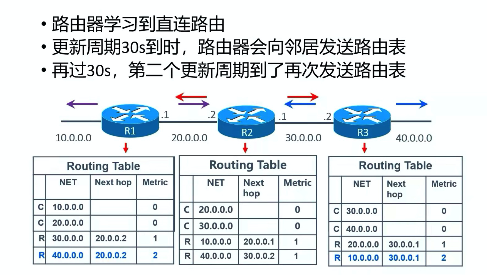

- 1、刚开始路由表中，有直连路由（这个自动生成）

- 2、时间到了，相邻的路由，会相互发送路由表，供其他路由参考学习，动态更新自己的路由表（只有相邻的路由会发送）

  
  - 学习规则
    - R1给R2发送自己的路由表
    - R2知道，这个路由表是从20.0.0.1发送过来的
      - 并且R1中有个直连路由 10.0.0.0
    - R2就会知道，去 10.0.0.0 的下一跳为 20.0.0.1
      - 并且只会经过一步（R1）
    - 于是R2就会学习到一条路由规则，与自己的路由表比较，然后更新路由表
      - 如果，R2中没有去 10.0.0.0 的路由，则直接更新
      - 如果，R2中有去 10.0.0.0 的路由
        - 如果步数大于新的步数（比如3 > 1），就会认为新的是最优方案，就会替换旧的
        - 如果步数小于新的步数，不进行操作，忽略新的这个路由（旧的最优）
        - **有种情况下不考虑步骤，直接更新**
          - 比如：40.0.0.0 是从 R3学习的，此时的步骤为1
          - R3的路由表中又有一个 40.0.0.0，步骤为2
          - 30s过后，相互更新路由表，R3给R2发送自己的路由表
          - R2一看，我的 40.0.0.0 是从R3学的，R3中又有一个 40.0.0.0，于是会直接学习，步骤在R3的基础上加一，变成3（虽然3比1大，但是不考虑，因为来源就是R3）
          - **这种情况，路由环路中会出现**

- 3、30s时间到了，相邻的路由器会再次相互发送自己的路由表，让邻居学习更新自己的路由表

  - R3学习R2的，发现有一个 10.0.0.0 可以通过 30.0.0.1 到达
  - 于是就会学习，产生一条记录，并且步数在原有的基础上 +1（变成2步）
    - 多经过一个R2，所以步骤需要加一

- 4、RIP的一些概念

  