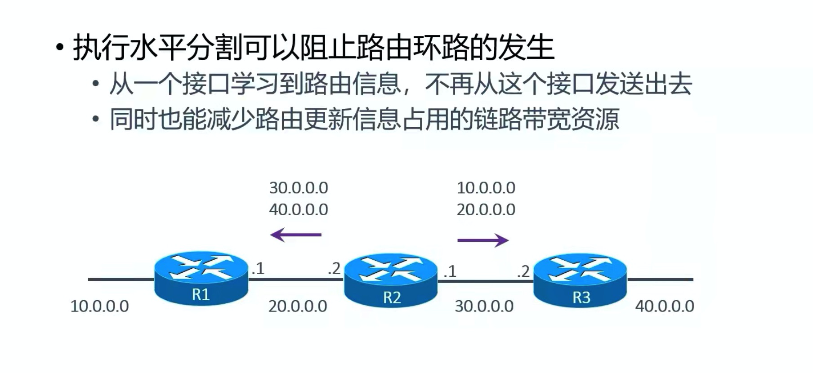

#### 路由环路产生的过程
- 造成的原因：学习到了错误的路由（并且有概率性是好的）

#### 坏的情况

  
  - 忽然 40.0.0.0 坏掉了，此时R3的直连路由就会消失
  - 如果R2在R3给R2发送自己的路由表之前，把自己的路由表发给了R3**环路出现概述**
    - 于是就会学习R2的40.0.0.0，且下一跳为 30.0.0.1（从这个IP发过来的），步骤  +1 变成2
    - 然后，30s到了，相邻的路由器继续相互发送自己的路由表，进行更新
      - R2接受到R3的路由表，此时R3中有一个错误路由 40.0.0.0
      - R2一看，你能到达 40.0.0.0 ，我自己也有一条 40.0.0.0 的路由
      - 虽然步骤是1，R3的步骤为2，要在此基础上 +1，变3，但是由于 R2的 40.0.0.0 路由就是从R3学的
      - **会直接使用3，不考虑优先级**
    - 然后，30s又到了继续更新路由表，R2的路由表发给R3
      - R3一看，我此时的表中 40.0.0.0 的路由，是来自R2
      - **于是直接更新，步数变成4**
    - 然后，30s又到了继续更新路由表，R3的路由表发给R2
      - R2一看，我此时的表中 40.0.0.0 的路由，是来自R3
      - **于是直接更新，步数变成5**
    - 就这样陷入循环，一直到步数变成16（目标不可达），不再进行学习
    - 由于，R1的 40.0.0.0 路由来自 R2，所以也会跟着R2的更新而进行更新，最终步数也变成 16
    - **最终，所有路由表中的 40.0.0.0 的步数都会变成 16**
- 虽然，步数最终会达到16，不再更新路由，但是R3中有一个错误的路由
  - R3的 40.0.0.0 指向 R2，R2的 40.0.0.0 指向 R3
  - **这样就形成了一个环路**，当进行路由的时候，40.0.0.0网段的包，就会在R2和R3之间来回震荡，直到TTL变成0，然后消失

#### 好的情况
- 如果R3先发给R2，则不会出现环路
  - R2会直接把 40.0.0.0的步数变成16
  - 然后发给 R2，R2中的路由步数直接更新成16，就不会产生上面的，递增问题
  - 
- 虽然，这种情况，40.0.0.0 的步数也都会变成 16，但是R3中的 40.0.0.0 路由是正确的，并没有指向R2，也就不构成路由环路
  - 40.0.0.0网段的包到达R3，然后路由到达直连端口就完了，数据包不会来回震荡

#### 解决办法（也能优化动态路由的效率，减少带宽占用）
- R3的错误路由，是学习的R2的，则下次发送的时候，不让R2发送对应的路由，R3就学习不到错误的路由了

- 一般现在的路由器都有这个功能，不用手动开启