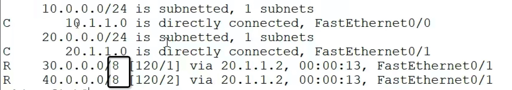
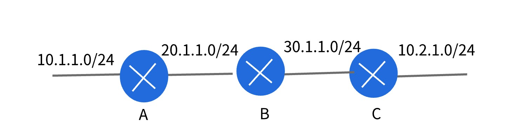

#### 配置命令
```conf
router rip
version 2  # 启用2版本，后面还有一个命令，需要配合使用，下面介绍原因以及作用

# 开启两个直连网关（开启两个端口，这样才能接收到相邻路由发送过来的路由表）
network 10.0.0.0
network 20.0.0.0
# 哪怕一侧是台电脑，network也得用两次
#  不用给他发送路由，也不用接受他的路由，但是这一侧的network也得开启
```

- 配置network的时候，需要注意
  - 网段的写法，要严格按照A、B、C的格式写
  - 比如P1端口，用的是A类网段，但是配置的子网掩码是 255.255.255.0（是C类的）
    - 这样网段就可以写成 10.193.12.0
    - 即：P1的直连网段，是10.193.12.0
    - 但是写 network的时候，不能这样写，必须写成A类的
      - 即：network 10.0.0.0

- network对网段的书写，比较严格，路由表学习后的现象也比较奇怪


#### 学习后的奇怪现象
- 比如：


- 直连的都是：10.1.1.0、20.1.1.0
  - 因为10、20虽然是A类，但是配置的子网掩码却是255.255.255.0（24个8）
  - 直连路由的上面一行，有 10.0.0.0/24，表示10.1.1.0这个网段属于A类，但是子网掩码是24
- 但是动态学习的路由列表却是：30.0.0.0/8、40.0.0.0/8
  - 对应路由（学习的路由）的直连路由是30.1.1.0/24、40.1.1.0/24
  - 为什么学习后，就变成了30.0.0.0/8、40.0.0.0/8
  - 原因：就是子网掩码在作怪

- 1版本，路由间相互学习的时候，不会发送子网掩码
  - 就发送一个30.1.1.0、40.1.1.0
  - 接收到的路由一看，你没有子网掩码，那就按照国际定义的来，这两个网段是A类，子网掩码就为 8
  - 子网掩码为8，则网段就变成了30.0.0.0/8、40.0.0.0/8
    - 知识扩充：如果子网掩码是16，则网段就变成了30.1.0.0/16、40.1.0.0/16
    - 网段和子网掩码有关（之前的知识）
  - 所以学习完是上面的情况
- 2版本（上面命令中开启的就是2版本），会发送子网掩码
  - 既然会发送子网掩码，照理学习完应该是30.1.1.0/24、40.1.1.0/24
  - 但是结果还是8的原因就是，**路由学习动态路由的时候默认忽略子网掩码**
  - 即，对方发送过来自己的子网掩码，但是没用，路由学习的时候还是按照国际来
  - 于是也学习成了30.0.0.0/8、40.0.0.0/8
  - **可以通过命令配置，让路由学习的时候，考虑对方发送过来的子网掩码**
    ```conf
    # 在路由上输入该命令，则该路由学习其他路由的时候就会考虑对方发送过来的子网掩码
    no auto-summary
    # 版本2，这个命令才有效
    #   版本1，都不发送子网掩码，开启了也无效
    ```
    - 这样学习完的结果就变成了 30.1.1.0/24、40.1.1.0/24


#### 动态路由学习不考虑子网掩码，引发的问题
- 一般情况下没有问题，能正常路由（没有重复使用国际模式下的网段）
  - 比如IP为：30.1.1.9
    - 既可以属于网段：30.1.1.0/24
    - 也可以属于网段：30.0.0.0/8
  - 考虑子网掩码，路由变成：30.1.1.0/24，30.1.1.9属于这个网段，可以匹配成功，进行下一跳
  - 不考虑子网掩码，路由变成：30.0.0.0/8，30.1.1.9照样属于这个网段，可以匹配成功，进行下一跳
    - **疑问**: 比如有人说，IP为 30.2.1.9，属于网段30.0.0.0/8不属于网段30.1.1.0/24，这样就产生了差别
      - 但是，路由结构中，真正的网段是30.1.1.0/24
      - IP为：30.2.1.9，不属于该网络结构
      - 所以，访问30.2.1.9势必会失败（找不到）
    - 即使学习路由可以通过30.0.0.0/8匹配成功，进行下一跳，但是直连路由学习的是真实网段30.1.1.0/24，会匹配失败，没有下一跳
    - 所以，30.2.1.9是不会出现的（**所以这种情况：学习不学习子网掩码没有影响**）
      - 即使出现了，学习不学习子网掩码，都会匹配失败
      - 无非一个在学习路由就失败了（参考子网淹没）、一个在直连路由就失败了（不参考子网淹没）

- 有问题，不能正常路由（重复使用国际模式下的网段）
  - 比如：
  
  - 出现了两个 10，并且B到达这两个 10 的步骤还一样
  - B学习A和C的路由时，如果不考虑子网掩码，就会出现如下现象
    - 去 10.0.0.0/8网段，下一跳是A，步数1
    - 去 10.0.0.0/8网段，下一跳是C，步数1
    - 产生了冲突，并且步数一致，没有优先级
    - 这种情况下，就会把这两条路由合并成一条
      - 合成的这条路由有一个现象
      - 当IP匹配成功的时候（比如：10.1.1.2）
      - 会先把下一跳指向A，或者C（也就是把数据包发往A或者B）
      - 然后，当下一次匹配成对的时候，在往另一个路由
        - 即：前一个往A，下一个往C
    - **这样就会造成一个现象，一会通一会不通**
      - 比如：访问10.1.1.2，如果往A路由的时候，可以通，往C路由的时候，C没有这个IP网段的直连，所以无法路由，也就造成不通
      - 访问C下的IP，也一样，C通A不通
    - 如果步数不一样：则取步数小的，另一个忽略
      - 这样，造成的现象，又不是一会通一会不通
      - **而是一个一直通，一个一直不通**

- 所以，这个命令 no auto-summary 还不能忽略，能开启就开启
  - 开启了虽然同属于A类，但是有子网掩码的作用，所以产生的路由不一样，也就不会合并，并且可以正常路由（该往A发的，往A发；该往C发的，往C发）