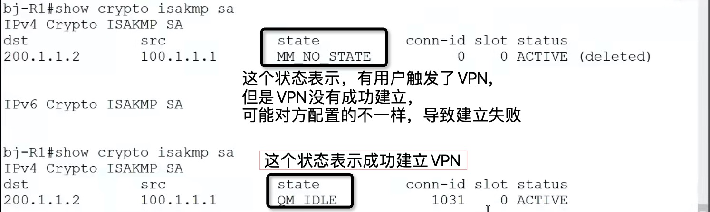
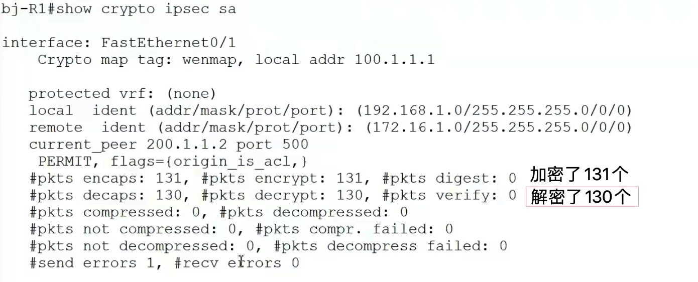
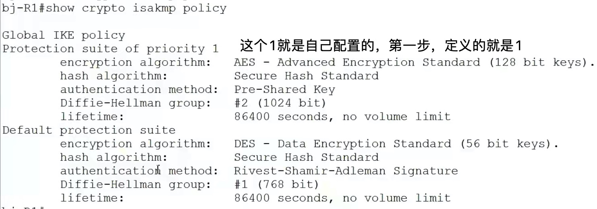

- 查看命令，可以有助于排错

- 查看路由器上有几个VPN，以及每个VPN的状态
  ```conf
  show crypto isakmp sa
  ```
  

  - 有几个vpn，表中就有几条信息

|

- 查看VPN通道，加密了几个数据包，解密了几个数据包
  ```conf
  show crypto ipsec sa
  ```
  


|
- VPN通信，分为两个阶段，一个是管理连接，一个是数据连接
- 查看管理连接的配置（第一步的配置）
  ```conf
  show crypto isakmp policy
  ```
  
  

|
- 查看数据连接的配置（第三步的配置）
  ```conf
  show crypto ipsec transform-set
  ```
  