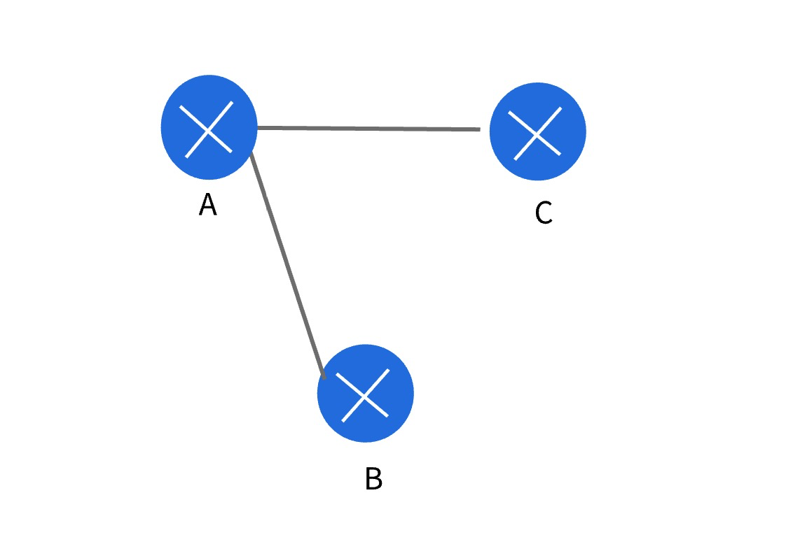

- 在真实的路由器上，能开启的VPN通道个数有限，要想多开启几个，需要交钱

- 所以，有些不重要的VPN可以用已有的VPN通道，进行中转加密传输（相当于中转）
  - **方式：在VPN的ACL多配置几条允许的规则就行**
  - 比如：A 到 B 有个VPN通道，A 到 C 有个VPN通道
    - 本来
      - A 到 B 的VPN通道，只允许 A --> B 或者 B --> A 的包走
      - A 到 C 的VPN通道，只允许 A --> C 或者 C --> A 的包走
    - B 和 C 要想实现VPN通道，就可以借用这两个VPN通道，用A做个中转（在B和C的ACL中加一条就行允许规则就行）
    - 添加的规则
      - 在 B 的ALC中，加入一条，目标IP是去C的包也能走这个VPN（本来只有一条，去A的）
      - 在 C 的ALC中，加入一条，目标IP是去B的包也能走这个VPN（本来只有一条，去A的）
    - 当 B 往 C 发包的时候，到达出端口，与ACL进行匹配
      - B的ACL一看，吆喝，符合，于是就把目标IP替换成了VPN对应的对方公网IP（不是C的，而是A的公网IP）
      - 这样，包就会根据目标IP到达 A
      - A 解密后，取回原始目标IP，是去C的，于是到达出端口，与端口的ACL进行匹配，发现能匹配上，于是就走了去往C的VPN
      - 这样，B 和 C 没有VPN通道，但是数据传输过程中，走的全是VPN通道，这就相当于 B 和 C 开启了VPN通道
    - C 往 B 回包的原理一样
      - 虽然，C接受的是A发过来的包，但是 A 的包是从 B 来的
      - 而VPN传输过程中，原始源IP不会改变，所以，包到达C后，原始源IP还是 B
      - 所以回包的时候，用的目标IP，是B的

