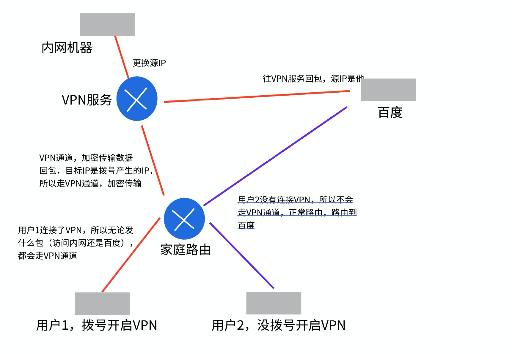

- 远程访问VPN，需要一台VPN服务器，并且这个VPN服务器需要有两个网卡，一个入一个出（一个连外网，一个连内网）
  
- 远程访问VPN的核心，就是拨号

- VPN服务器，也是一个路由器，只不过多了VPN的功能

- 工作原理
  - 当前电脑，对VPN服务器拨号，VPN服务器，会返回一个IP（该会作为当前电脑的临时IP）
  - 当IP返回回来的时候，在自己的路由器上，就已经和VPN服务器搭建好了一个VPN通道
    - 当源IP是临时IP的请求包，就会走这个VPN隧道（其他电脑走不了）
      - 由于当前电脑，不知道什么包走VPN，干脆所有的包都走VPN
      - **即，只要该电脑拨号成功，得到一个IP，则该电脑所有的包的源IP都是这个IP**
      - 这样，只要是该电脑发出的包，源IP都是VPN服务器分配的IP，则到达路由器后，就都会走VPN隧道了
    - **目标IP会替换成VPN服务器的**
      - 这样，数据包就会发往VPN服务器对应的公网IP
    - 数据到达VPN服务器后，把源IP和目标IP复原（点对点VPN中有介绍）
      - 这样，数据包就会根据目标IP该去哪去哪（去内网的去内网，去其他网络的去其他网络（比如百度））
      - 也就是说，进行了VPN拨号，所有的包都会走VPN到达VPN服务器，即使访问百度也不例外，只不过是访问百度的数据包到达VPN服务器后，再由VPN服务器，往百度路由（目标IP已经复原），到达百度后，回包的时候，再往源IP进行回包
  - **通常，VPN服务器会配置一个NAT，把源IP改成自己的**
    - NAT的作用，就是在数据包出去的时候，修改源IP
    - 也就是说，数据包到达VPN服务器后，VPN服务器会把源IP和目标IP进行复原
    - 然后在根据，原始的目标IP进行路由，但是在数据包出VPN服务器的时候，由于配置了NAT，会把源IP换成自己的
    - **这样做的意义，让其他路由、服务，以为访问的是这个VPN服务器**
      - 也就是说，上例中，访问百度，百度回包，回的是VPN服务器，当VPN服务器收到回包后，在根据NAT映射，把目标IP换成之前的源IP，然后VPN服务器再次路由，最终回到自己的手里
        - VPN服务器再次路由的时候，目标IP就是走VPN通道的虚拟IP（拨号产生的IP），于是回包也会走VPN通道，顺利安全的回到访问者手中
      - **百度以为访问者是VPN服务器，因为源IP是他的，这也是翻墙的原理**

- 图解
  

  - 这也是，为什么开启了VPN，如果VPN服务的IP是在美国，登陆QQ的时候，定位显示美国
    - 因为，所有的数据包会走VPN到达美国，然后由美国VPN服务，访问QQ，由于更换了源IP（美国）
    - QQ一看，源IP是美国，就以为是在美国访问的我，于是位置就会显示美国

|
- 翻墙的原理
  - 比如访问美国网站，在中国总出口，有个防火墙，过滤请求
  - 如果在美国搭了一个VPN服务，播完号后，数据包会加密到达总出口防火墙，由于数据加密，防火墙无法过滤，于是就会到达美国VPN
  - 然后，美国VPN服务，继续发送包（启用NAT，修改源IP），这样美国的网站就会以为，访问的是美国的，于是也不进行拦截
  - 这样，数据回包就会往VPN服务回，到达VPN服务后，加密往国内传，由于数据加密，防火墙也无法过滤回包，于是数据回包就会到达访问者
  - 访问和回包都能正常进行，这就是翻墙的原理

   

